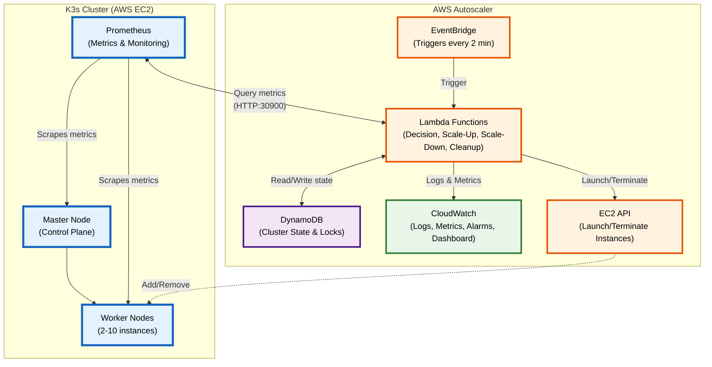
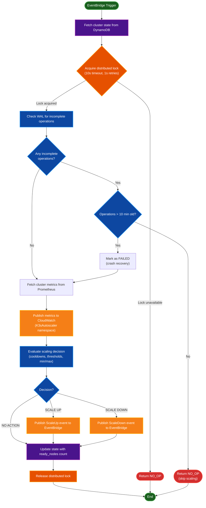
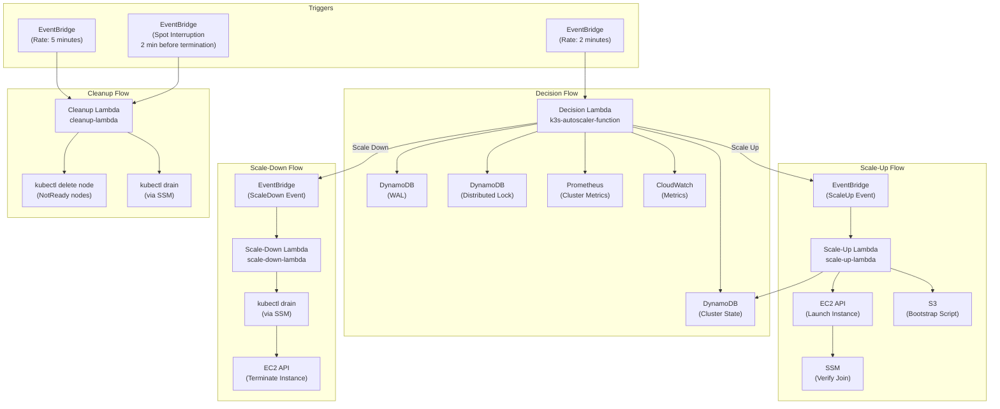

# ElastiKube

Production-grade autoscaling system for K3s clusters on AWS using event-driven Lambda architecture, DynamoDB state management, and EC2.

## Project Overview

This autoscaler monitors K3s cluster metrics via Prometheus and automatically scales worker nodes based on CPU, memory, and pod scheduling pressure. It uses an event-driven architecture with Lambda functions orchestrated through EventBridge for fault tolerance and retry capabilities.

### System Architecture



## Key Components

| Component | Purpose | Technology |
|-----------|---------|------------|
| **Decision Lambda** | Makes scaling decisions based on metrics | Python 3.11, Prometheus API |
| **Scale-Up Lambda** | Launches new EC2 worker instances | Python 3.11, EC2 API |
| **Scale-Down Lambda** | Drains and terminates workers | Python 3.11, kubectl via SSM |
| **Cleanup Lambda** | Stale node cleanup every 15 minutes | Python 3.11, EC2 API |
| **State Management** | Distributed locking & cluster state | DynamoDB (2 tables) |
| **WAL** | Write-Ahead Log for crash recovery | DynamoDB |
| **EventBridge** | Orchestrates Lambda chaining | AWS EventBridge |
| **Metrics Collection** | Cluster metrics scraping | Prometheus (in-cluster) |
| **Token Storage** | K3s join token & bootstrap scripts | AWS S3 |
| **Monitoring** | Logs, metrics, dashboards | CloudWatch |

**<!-- TODO: Add detailed Lambda interaction flow diagram showing EventBridge orchestration -->**

**<!-- TODO: Add data flow diagram showing Prometheus → Lambda → EventBridge → Scale-Up/Down Lambdas -->**


## Architecture


### Scaling Decision Flow



### Scaling Logic

The Decision Lambda evaluates scaling conditions in a specific order defined in `decision-lambda/src/scaler/scaling.py`:

**Evaluation Order:**
1. Check scale-up cooldown (blocks all scale-up if active)
2. Check scale-up conditions (CPU OR pending pods)
3. If scale-up not triggered, check scale-down cooldown (blocks only scale-down)
4. Check scale-down conditions (CPU AND memory both low)

**Scale UP when ALL of these conditions are met:**
- NOT in scale-up cooldown (default: 300 seconds)
- AND (Worker CPU >= scale_up_threshold (default: 70%) OR Pending pods >= 1)
- AND Current total nodes < max_nodes (default: 10)
  - Note: `total_nodes` includes the master node in the count

**Scale DOWN when ALL of these conditions are met:**
- NOT in scale-down cooldown (default: 900 seconds)
- AND Worker CPU < scale_down_threshold (default: 30%)
- AND Worker Memory < 50% (hardcoded threshold, not configurable)
- AND Current total nodes > min_nodes (default: 2)
  - Note: `total_nodes` includes the master node in the count

**Important Notes:**
- Scale-up and scale-down cannot both occur in the same evaluation cycle
- Pending pods condition takes precedence and can trigger scale-up even during scale-down cooldown
- The scale-down memory threshold (50%) is hardcoded in the scaling engine and not configurable via environment variables
- Node count checks use `total_nodes` from Kubernetes, which includes the master/control-plane node

### Cooldown Behavior

- **Scale-up cooldown**: Checked first, blocks ALL scale-up operations when active
- **Scale-down cooldown**: Checked after scale-up evaluation, only blocks scale-down operations
- **Pending pods override**: The presence of pending pods (>= 1) can trigger scale-up even when in scale-down cooldown
- **Cooldown calculation**: Based on `last_scale_time` timestamp in DynamoDB state, measured in seconds since last scaling operation
- **Default values**: 300 seconds (5 minutes) for scale-up, 900 seconds (15 minutes) for scale-down

### Distributed Lock

- Uses DynamoDB conditional writes (optimistic locking)
- Sets `scaling_in_progress=true` only if currently `false`
- 10 second timeout with 1-second retries
- If lock unavailable, returns `NO_OP` immediately
- Always released in `finally` block to prevent deadlocks

### Crash Recovery (WAL)

- Write-Ahead Log tracks all scaling operations
- Incomplete operations older than 10 minutes marked as FAILED
- Recent incomplete operations block new scaling
- Prevents duplicate operations after Lambda restart

### LIFO Scaling Strategy

The scale-down operation uses **LIFO (Last In, First Out)**:
1. Excludes permanent workers (tagged `Permanent=true`)
2. Prefers autoscaler-created workers (tagged `CreatedBy=autoscaler`)
3. Selects most recently launched worker
4. Executes `kubectl drain` before termination

## Lambda Function Details

### Event-Driven Lambda Chain



### Decision Lambda (`k3s-autoscaler-function`)

**Trigger:** EventBridge rule (every 2 minutes)

**Key Responsibilities:**
1. Acquire distributed lock (10s timeout, 1s retries)
2. Check WAL for incomplete operations (crash recovery)
3. Fetch cluster metrics from Prometheus
4. Publish metrics to CloudWatch (`K3sAutoscaler` namespace)
5. Evaluate scaling decision
6. Publish EventBridge event if scaling needed
7. Update state with current `ready_nodes` count
8. Release distributed lock (always in `finally` block)

**Health Check:** Invoke with `{"action": "health_check"}`

### Scale-Up Lambda (`scale-up-lambda`)

**Trigger:** EventBridge `ScaleUp` events from decision Lambda

**Idempotency Layers (checked before launching):**
1. **Bootstrap credentials check** - SSM master IP + Secrets Manager join token
2. **Cooldown check** (3 min) - Prevents rapid successive scale-ups
3. **Scaling in progress check** - Persistent `scaling_in_progress` flag (auto-clears stale flags > 5 min)
4. **Pending instances check** - Looks for unverified instances < 5 min old
5. **Distributed lock** (200s timeout) - Prevents concurrent execution

**Launch Process:**
1. Fetch bootstrap script from S3 (`USER_DATA_S3_BUCKET/USER_DATA_S3_KEY`)
2. Launch EC2 instance with tags: `CreatedBy=autoscaler`, `Permanent=false`
3. Poll for `JoinStatus` tag (set by bootstrap script) every 10s (180s timeout)
4. Tag instance as `JoinVerified=true` on success
5. Update DynamoDB state with `last_scale_operation=SCALE_UP`

**Instance Tags:**
- `Name`: `k3s-worker-{cluster_name}-{uuid}`
- `Cluster`: `{cluster_name}`
- `NodeRole`: `worker`
- `Permanent`: `false`
- `CreatedBy`: `autoscaler`
- `JoinStatus`: `success`/`failed` (set by bootstrap script)
- `JoinVerified`: `true` (set by Lambda after verification)

**Manual Actions:** `launch`, `describe`, `terminate`

### Scale-Down Lambda (`scale-down-lambda`)

**Trigger:** EventBridge `ScaleDown` events from decision Lambda, or direct invocation

**Supported Actions:**
- `list` - List all worker instances
- `describe` - Describe specific worker details
- `drain` - Drain a worker node via kubectl (SSM, 120s timeout)
- `terminate` - Terminate a worker instance (runs uninstall first)
- `scale_down` - Execute LIFO scale-down

**LIFO Scale-Down Strategy:**
1. List all workers (filter by `Cluster` and `NodeRole=worker` tags)
2. Exclude permanent workers (`Permanent=true` tag)
3. Sort by launch time (most recent first)
4. Prefer autoscaler-created workers (`CreatedBy=autoscaler` tag)
5. Execute `kubectl drain --ignore-daemonsets --delete-emptydir-data --timeout=120s` via SSM
6. Run `k3s-agent-uninstall.sh` via SSM (graceful K3s agent removal)
7. Terminate EC2 instance
8. Update DynamoDB state with new `node_count`

**Node Name Format:** `ip-{private_ip}` (e.g., `ip-10.0.2.42`)

### Cleanup Lambda (`cleanup-lambda`)

**Trigger:** EventBridge (rate 5 minutes), Spot Interruption Warnings, or manual invocation

**Supported Actions:**
- `health_check` - Health check endpoint
- `clean_stale_nodes` - Remove NotReady K8s nodes only

**Phase 1 - Failed EC2 Instance Cleanup:**
Finds instances that:
- Have `CreatedBy=autoscaler` tag
- Running for > 5 minutes (`MAX_INSTANCE_AGE_MINUTES` env var)
- No `JoinVerified=true` tag OR `CleanupRequired=true` tag

Uses SSM to verify node actually joined cluster (runs `check-node-by-ip.sh` on master) before terminating.

**Phase 2 - Stale Kubernetes Node Cleanup:**
- Runs `kubectl get nodes --no-headers | grep NotReady` via SSM
- Deletes each NotReady node individually via `kubectl delete node`
- Returns summary of deleted/failed nodes

**Spot Instance Interruption Handler:**
- Triggered 2 minutes before spot termination by EventBridge
- Extracts instance ID from event detail
- Finds node by private IP via `kubectl get nodes -o wide`
- Executes `kubectl drain --timeout=90s --force` and `kubectl delete node`
- Tags instance with `SpotInterruptionHandled=true`

**Default Schedule:** Every 15 minutes via EventBridge

## Infrastructure

The AWS infrastructure is defined in `infrastructure/pulumi/__main__.py` using Pulumi (Infrastructure as Code). Below is a summary of the provisioned resources:

### VPC & Networking

| Resource | CIDR/IP | Purpose |
|----------|---------|---------|
| VPC | `10.0.0.0/16` | Main network for K3s cluster |
| Public Subnet | `10.0.1.0/24` | Bastion host (SSH access) |
| Private Subnet | `10.0.2.0/24` | K3s cluster nodes |
| Internet Gateway | - | Public internet access |
| NAT Gateway | Elastic IP | Outbound internet for private subnet |
| Route Tables | 2 | Public/Private routing |

### Security Group (`k3s-cluster-secgrp`)

**Inbound Rules:**
- Port `22` (SSH) from `0.0.0.0/0` (restrict in production)
- Port `6443` (Kubernetes API) within VPC
- Port `30900` (Prometheus NodePort) within VPC
- Port `9090` (Prometheus) within VPC
- Port `8472` (Flannel VXLAN) within VPC
- Ports `30000-32767` (NodePort range) within VPC
- Port `9100` (Node Exporter) self
- Port `10250` (Kubelet) self

**Outbound:** All traffic allowed

### DynamoDB Tables

| Table | Purpose | Key Schema |
|-------|---------|------------|
| `k3s-cluster-state` | Cluster state, scaling status, locks | Hash: `cluster_id` |
| `k3s-scaling-wal` | Write-Ahead Log for crash recovery | Hash: `operation_id`, Range: `started_at` |

Both tables have:
- PAY_PER_REQUEST billing mode
- Point-in-time recovery enabled
- TTL enabled for automatic cleanup
- GSI indexes for querying by scaling status and incomplete operations

### Lambda Functions

| Lambda | Runtime | Memory | Timeout | VPC | Purpose |
|--------|---------|--------|---------|-----|---------|
| Decision Lambda | Python 3.11 | 256MB | 300s | Yes | Queries Prometheus, makes scaling decisions |
| Scale-Up Lambda | Python 3.11 | 256MB | 300s | Yes | Launches new EC2 worker instances |
| Scale-Down Lambda | Python 3.11 | 256MB | 300s | Yes | Drains & terminates worker nodes |
| Cleanup Lambda | Python 3.11 | 128MB | 60s | Yes | Removes failed/stale nodes |

All Lambdas share the same IAM role (`k3s-autoscaler-lambda-role`) with permissions for:
- EC2 (RunInstances, TerminateInstances, DescribeInstances, CreateTags)
- DynamoDB (CRUD on state and WAL tables)
- SSM (GetParameter, SendCommand for kubectl drain)
- EventBridge (PutEvents for Lambda chaining)
- CloudWatch (PutMetricData, Logs)
- Secrets Manager (Get K3s join token)
- S3 (Get bootstrap scripts)

### EventBridge Rules

| Rule | Trigger | Target | Detail Type |
|------|---------|--------|-------------|
| `k3s-autoscaler-schedule` | Every 2 minutes | Decision Lambda | - |
| `k3s-scale-up-rule` | ScaleUp event | Scale-Up Lambda | `k3s.autoscaler` |
| `k3s-scale-down-rule` | ScaleDown event | Scale-Down Lambda | `k3s.autoscaler` |
| `k3s-cleanup-schedule` | Every 15 minutes | Cleanup Lambda | - |
| `k3s-spot-interruption` | Spot termination warning (2 min) | Cleanup Lambda | EC2 Spot Interruption |

### EC2 Instances (Seed Nodes)

| Instance | Type | Private IP | Purpose |
|----------|------|------------|---------|
| Bastion | t3.micro | `10.0.1.10` | SSH jump host (public IP) |
| Master | t3.small | `10.0.2.10` | K3s control plane |
| Worker 1 | t3.small | `10.0.2.11` | Permanent worker |
| Worker 2 | t3.small | `10.0.2.12` | Permanent worker |

**Note:** Workers 1 and 2 are tagged with `Permanent=true` and excluded from scale-down operations.

### IAM Roles & Instance Profiles

| Role | Purpose | Attached Policies |
|------|---------|-------------------|
| `k3s-autoscaler-lambda-role` | Lambda execution | AWSLambdaBasicExecutionRole, AWSLambdaVPCAccessExecutionRole, custom policy |
| `k3s-worker-node-role` | Worker instance profile | AmazonSSMManagedInstanceCore, AWSSecretsManagerClientReadOnlyAccess, custom policy |
| `k3s-master-node-role` | Master instance profile | AmazonSSMManagedInstanceCore, SecretsManagerReadWrite, custom CloudWatch policy |

### SQS Dead Letter Queues

| Queue | Purpose | Retention |
|-------|---------|-----------|
| `k3s-scale-up-dlq` | Failed scale-up events | 14 days |
| `k3s-scale-down-dlq` | Failed scale-down events | 14 days |

### CloudWatch Alarms

| Alarm | Metric | Threshold | Period |
|-------|--------|-----------|--------|
| High CPU | ClusterCPU > 85% | 2 periods | 5 min |
| Scaling Failure | ScalingErrors > 3 | 1 period | 10 min |
| Lock Timeout | LockAge > 300s | 1 period | 1 min |
| Provisioning Timeout | NodeProvisioningTime > 600s | 1 period | 1 min |
| Scale-Up EventBridge Failures | FailedInvocations > 0 | 1 period | 5 min |
| Scale-Down EventBridge Failures | FailedInvocations > 0 | 1 period | 5 min |
| DLQ Messages (both) | ApproximateNumberOfMessagesVisible > 0 | 1 period | 5 min |
| DLQ Age (both) | ApproximateAgeOfOldestMessage > 3600s | 1 period | 5 min |

### Other Resources

| Resource | Name/Path | Purpose |
|----------|-----------|---------|
| SSM Parameter | `/k3s/{cluster_name}/master-ip` | Master node IP for worker join |
| Secrets Manager | `k3s-{cluster_name}-join-token` | K3s cluster join token (sensitive) |
| S3 Bucket | `k3s-userdata-{cluster_name}` | Worker bootstrap scripts |
| CloudWatch Dashboard | `K3s-Cluster-Comprehensive` | Metrics visualization |


## Quick Start

### Prerequisites

- AWS CLI configured with appropriate credentials
- Pulumi >= 3.0
- Ansible >= 2.15
- Python 3.11+
- [uv](https://github.com/astral-sh/uv) package manager

### Deploy Infrastructure

```bash
# 1. Create Pulumi stack
cd infrastructure/pulumi
pulumi stack init k3s-production-stack

# 2. Preview and deploy
pulumi up
```

### Deploy K3s Cluster with Ansible

```bash
cd infrastructure/ansible
ansible-playbook -i inventory/hosts.ini site.yml
```

### Deploy Lambda Functions

```bash
# Build and deploy all Lambdas
cd decision-lambda && ./build.sh && cd ..
cd scale-up-lambda && ./build.sh && cd ..
cd scale-down-lambda && ./build.sh && cd ..
cd cleanup-lambda && ./build.sh && cd ..

# Deploy via Pulumi
cd infrastructure/pulumi && pulumi up
```

### Deploy CloudWatch Dashboard

```bash
cd monitoring/scripts
./update-dashboard.sh
```
> **Note:** GitHub Actions workflows are disabled (`.github/workflows.disabled/`). Use manual deployment for infrastructure and application changes.

## Directory Structure

```
production/
├── .github/workflows.disabled/  # Disabled GitHub Actions workflows
├── infrastructure/
│   ├── pulumi/                 # Pulumi IaC for AWS resources
│   │   ├── __main__.py        # Main Pulumi program
│   │   ├── Pulumi.yaml        # Pulumi configuration
│   │   └── README.md          # Pulumi setup guide
│   ├── ansible/                # Ansible playbooks for K3s setup
│   │   ├── site.yml           # Main playbook
│   │   ├── worker-bootstrap.yml
│   │   └── roles/
│   │       ├── k3s-master/
│   │       └── k3s-worker/
│   └── scripts/                # Deployment scripts
├── decision-lambda/            # Autoscaler decision engine
│   ├── main.py               # Lambda entry point
│   ├── src/
│   │   ├── metrics/          # Prometheus client
│   │   ├── scaler/           # Scaling decision logic
│   │   ├── state/            # DynamoDB state manager
│   │   └── utils/            # Utilities (WAL, locks)
│   ├── tests/                # Unit tests
│   └── build.sh              # Package builder
├── scale-up-lambda/           # EC2 instance launcher
│   ├── main.py               # Lambda entry point
│   └── build.sh
├── scale-down-lambda/         # Worker drain & terminate
│   ├── main.py               # Lambda entry point
│   └── build.sh
├── cleanup-lambda/            # Stale node cleanup
│   ├── main.py               # Lambda entry point
│   └── build.sh
├── monitoring/
│   ├── dashboards/           # CloudWatch dashboard JSON
│   │   ├── k3s-cluster-dashboard.json
│   │   └── k3s-cluster-dashboard-template.json
│   ├── alarms/               # CloudWatch alarms
│   └── scripts/              # Dashboard update script
├── workloads/                # Test workloads for autoscaling
├── scripts/                  # Utility scripts
└── ci/                       # CI/CD configurations
```

## Configuration

### Decision Lambda Environment Variables

```bash
CLUSTER_NAME=production-k3s
PROMETHEUS_URL=http://<master-ip>:30900
STATE_TABLE_NAME=k3s-cluster-state
WAL_TABLE_NAME=k3s-scaling-wal
EVENT_BUS_NAME=default
MIN_NODES=2
MAX_NODES=10
SCALE_UP_THRESHOLD=70
SCALE_DOWN_THRESHOLD=30
SCALE_UP_COOLDOWN=300
SCALE_DOWN_COOLDOWN=900
DRY_RUN=false
```

### Scale-Up/Down Lambda Environment Variables

```bash
CLUSTER_NAME=production-k3s
SUBNET_ID=<subnet-id>
SECURITY_GROUP_ID=<sg-id>
IAM_INSTANCE_PROFILE=<profile-name>
AMI_ID=<ami-id>
INSTANCE_TYPE=t3.small
SSM_MASTER_IP_PARAM=/k3s/master-ip
S3_BUCKET=<bucket-name>
BOOTSTRAP_SCRIPT_KEY=user-data/worker-bootstrap.sh
```

## Monitoring

### CloudWatch Dashboard

The project includes a comprehensive CloudWatch dashboard at:
- **Dashboard Name**: `k3s-cluster`
- **URL**: `https://console.aws.amazon.com/cloudwatch/home?region=ap-southeast-1#dashboards:name=k3s-cluster`

**Dashboard displays:**
- **K3sAutoscaler Metrics**: Worker CPU/Memory, Master CPU/Memory, Pending Pods, Node Counts
- **Lambda Metrics**: Invocations, Errors, Duration, Concurrent Executions, Throttles
- **EventBridge Metrics**: Rule invocations
- **DynamoDB Metrics**: Read/Write capacity
- **Log Insights**: Error logs, scaling decisions, Lambda execution logs

### Automated Dashboard Updates

After each Pulumi deployment, update the dashboard with new resource names:

```bash
cd monitoring/scripts
./update-dashboard.sh
```

This script queries AWS for current Lambda function names and updates log query paths.

### CloudWatch Alarms

| Alarm | Trigger | Purpose |
|-------|---------|---------|
| High CPU | CPU > 85% for 10min | Cluster under pressure |
| Scaling Failure | > 3 errors in 10min | Autoscaler malfunction |
| Lock Timeout | Lock held > 5min | Distributed lock issue |

## Testing

### Deploy Test Workloads

```bash
# CPU stress test
kubectl apply -f workloads/cpu-stress.yaml
kubectl scale deployment cpu-stress --replicas=10

# Pending pod test
kubectl apply -f workloads/pending-pod.yaml
kubectl scale deployment pending-pod-test --replicas=20

# Clean up
kubectl delete -f workloads/
```

### Manual Lambda Invocation

```bash
# Trigger decision Lambda
aws lambda invoke --function-name k3s-autoscaler-function \
  --payload '{"action": "health_check"}' \
  --cli-binary-format raw-in-base64-out \
  response.json && cat response.json
```

## Troubleshooting

### Check Scaling Logs

```bash
# Decision Lambda logs
aws logs tail /aws/lambda/k3s-autoscaler-function --follow

# Scale-Up Lambda logs
aws logs tail /aws/lambda/scale-up-lambda --follow

# Scale-Down Lambda logs
aws logs tail /aws/lambda/scale-down-lambda --follow
```

### Check Cluster State

```bash
# Query DynamoDB for current state
AWS_PROFILE=k3s-temp-user aws dynamodb scan \
  --table-name k3s-cluster-state \
  --region ap-southeast-1
```

### Check WAL for Stuck Operations

```bash
# Query WAL for incomplete operations
AWS_PROFILE=k3s-temp-user aws dynamodb scan \
  --table-name k3s-scaling-wal \
  --filter-expression "attribute_not_exists(completed_at)" \
  --region ap-southeast-1
```


## Future Improvements

| Feature | Description | Benefit |
|---------|-------------|---------|
| **Multi-AZ Awareness** | Distribute workers across availability zones with zone-aware draining | Improved resilience during AZ failures |
| **Spot Instance Fallback** | Use Spot instances for cost savings with automatic On-Demand fallback when unavailable | Cost optimization with stability guarantees |
| **Predictive Scaling** | Use historical metrics trends to pre-scale before known traffic patterns | Proactive scaling, reduce lag during spikes |
| **Custom App Metrics** | Incorporate application-level metrics (queue depth, latency, error rates) into scaling decisions | More accurate scaling based on actual load |
| **GitOps Configuration** | Version-controlled configuration with auditable rollbacks via Git | Change management, traceability, safer deployments |
| **Slack Notifications** | Concise alerts for scale actions, drains, failures with troubleshooting context | Faster incident response, better operational awareness |

### Implementation Priority

**High Priority:**
- Multi-AZ Awareness (resilience)
- Spot Instance Fallback (cost + stability)
- Slack Notifications (operational visibility)

**Medium Priority:**
- Custom App Metrics (scaling accuracy)
- GitOps Configuration (operational excellence)

**Lower Priority:**
- Predictive Scaling (advanced optimization)

## License
MIT