# ElastiKube

Production-grade autoscaling system for K3s clusters on AWS using event-driven Lambda architecture, DynamoDB state management, and EC2.


## Project Overview

This autoscaler monitors K3s cluster metrics via Prometheus and automatically scales worker nodes based on CPU, memory, and pod scheduling pressure. It uses an event-driven architecture with Lambda functions orchestrated through EventBridge for fault tolerance and retry capabilities.

### System Architecture

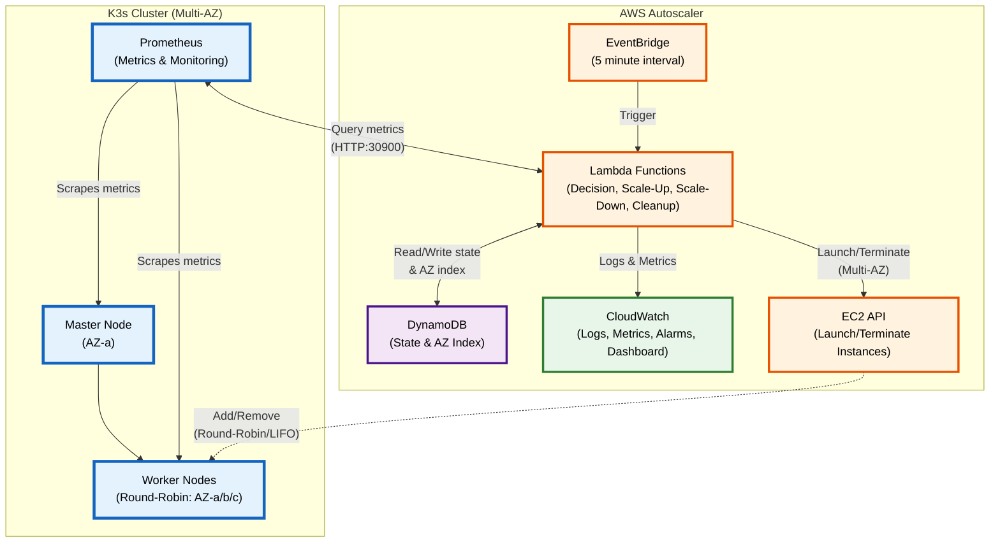

## Key Components

| Component | Purpose | Technology |
|-----------|---------|------------|
| **Decision Lambda** | Makes scaling decisions based on metrics | Python 3.11, Prometheus API |
| **Scale-Up Lambda** | Launches new EC2 worker instances | Python 3.11, EC2 API |
| **Scale-Down Lambda** | Drains and terminates workers | Python 3.11, kubectl via SSM |
| **Cleanup Lambda** | Stale node cleanup every 15 minutes | Python 3.11, EC2 API |
| **State Management** | Distributed locking & cluster state | DynamoDB (2 tables) |
| **WAL** | Write-Ahead Log for crash recovery | DynamoDB |
| **EventBridge** | Orchestrates Lambda chaining | AWS EventBridge |
| **Metrics Collection** | Cluster metrics scraping | Prometheus (in-cluster) |
| **Token Storage** | K3s join token, master IP, bootstrap scripts | AWS Secrets Manager, SSM Parameter Store, S3 |
| **Monitoring** | Logs, metrics, dashboards | CloudWatch |


## Architecture


### Scaling Decision Flow


### Scaling Logic

The Decision Lambda evaluates scaling conditions in a specific order defined in `decision-lambda/src/scaler/scaling.py`:

**Evaluation Order:**
1. **Flash Sale Detection** (emergency response, overrides cooldown)
2. Check scale-up cooldown (blocks all scale-up if active)
3. Check scale-up conditions (CPU OR pending pods)
4. If scale-up not triggered, check scale-down cooldown (blocks only scale-down)
5. Check scale-down conditions (CPU AND memory both low)

#### Layer 1: Data Collection (for Predictive Scaling)

Before any scaling evaluation, the system continuously collects metrics and scaling decisions for future ML-based predictive scaling:

- **Metrics Sampling**: Every 2 minutes, records CPU, memory, pending pods, worker count to `k3s-scaling-metrics-samples` DynamoDB table
- **Scaling History**: Every scaling decision recorded to `k3s-scaling-history` DynamoDB table with full context (metrics, decision, reason)
- **Data Retention**: 30 days (configurable via TTL)
- **Purpose**: Historical data trains Prophet models to forecast CPU 15 minutes ahead, enabling proactive scaling
- **Status**: Data collection active (v1.1), training pipeline complete, pending model integration

#### Layer 2: Time-Aware Scaling

The autoscaler uses different CPU thresholds based on time of day:

| Time Period | Hours | Scale-Up Threshold | Scale-Down Threshold |
|-------------|-------|-------------------|---------------------|
| **Peak** | 9 AM - 9 PM | 85% | 60% |
| **Off-Peak** | 9 PM - 9 AM | 60% | 40% |

**Why Time-Aware?**
- Peak hours have higher baseline CPU (70-80%), so thresholds are raised
- Prevents threshold thrashing (constant scale-up/down at boundary)
- Off-peak hours use lower thresholds for faster response to increased load

#### Layer 3: Flash Sale Detection (Emergency Response)

Before any cooldown checks, the system detects sudden CPU spikes:
- **Trigger**: CPU increase > 30% within 2 minutes
- **Action**: Immediate scale-up, bypasses all cooldowns
- **Purpose**: Handle sudden traffic surges (e.g., flash sales, viral content)

#### Standard Scaling Logic

**Scale UP when ALL of these conditions are met:**
- NOT in scale-up cooldown (default: 300 seconds)
- AND (Worker CPU >= time-aware threshold OR Pending pods >= 1)
- AND Current worker nodes < max_nodes (default: 10)
  - **Note**: Uses `worker_count` (excludes master), NOT `total_nodes`

**Scale DOWN when ALL of these conditions are met:**
- NOT in scale-down cooldown (default: 900 seconds)
- AND Worker CPU < time-aware threshold
- AND Worker Memory < 50% (hardcoded threshold, not configurable)
- AND Current worker nodes > min_nodes (default: 2)
  - **Note**: Uses `worker_count` (excludes master), NOT `total_nodes`

**Important Notes:**
- Scale-up and scale-down cannot both occur in the same evaluation cycle
- Pending pods condition takes precedence and can trigger scale-up even during scale-down cooldown
- The scale-down memory threshold (50%) is hardcoded in the scaling engine and not configurable via environment variables
- Node count checks use `worker_count` from Kubernetes, which **excludes** the master/control-plane node (v1.1 fix)

### Cooldown Behavior

- **Scale-up cooldown**: Checked first, blocks ALL scale-up operations when active
- **Scale-down cooldown**: Checked after scale-up evaluation, only blocks scale-down operations
- **Pending pods override**: The presence of pending pods (>= 1) can trigger scale-up even when in scale-down cooldown
- **Cooldown calculation**: Based on `last_scale_time` timestamp in DynamoDB state, measured in seconds since last scaling operation
- **Default values**: 300 seconds (5 minutes) for scale-up, 900 seconds (15 minutes) for scale-down

### Distributed Lock

- Uses DynamoDB conditional writes (optimistic locking)
- Sets `scaling_in_progress=true` only if currently `false`
- 10 second timeout with 1-second retries
- If lock unavailable, returns `NO_OP` immediately
- Always released in `finally` block to prevent deadlocks

### Crash Recovery (WAL)

- Write-Ahead Log tracks all scaling operations
- Incomplete operations older than 10 minutes marked as FAILED
- Recent incomplete operations block new scaling
- Prevents duplicate operations after Lambda restart

### LIFO Scaling Strategy

The scale-down operation uses **LIFO (Last In, First Out)**:
1. Excludes permanent workers (tagged `Permanent=true`)
2. Prefers autoscaler-created workers (tagged `CreatedBy=autoscaler`)
3. Selects most recently launched worker
4. Executes `kubectl drain` before termination

## Lambda Function Details

### Event-Driven Lambda Chain

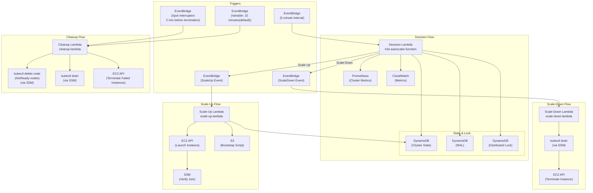

### Decision Lambda (`k3s-autoscaler-function`)

**Trigger:** EventBridge rule (5-minute interval)

**Key Responsibilities:**
1. Acquire distributed lock (10s timeout, 1s retries)
2. Check WAL for incomplete operations (crash recovery)
3. Fetch cluster metrics from Prometheus
4. Publish metrics to CloudWatch (`K3sAutoscaler` namespace)
5. Evaluate scaling decision
6. Publish EventBridge event if scaling needed
7. Update state with current `ready_nodes` count
8. Release distributed lock (always in `finally` block)

**Health Check:** Invoke with `{"action": "health_check"}`

### Scale-Up Lambda (`scale-up-lambda`)

**Trigger:** EventBridge `ScaleUp` events from decision Lambda

**Idempotency Layers (checked before launching):**
1. **Bootstrap credentials check** - SSM master IP + Secrets Manager join token
2. **Cooldown check** (3 min) - Prevents rapid successive scale-ups
3. **Scaling in progress check** - Persistent `scaling_in_progress` flag (auto-clears stale flags > 5 min)
4. **Pending instances check** - Looks for unverified instances < 5 min old
5. **Distributed lock** (200s timeout) - Prevents concurrent execution

**Launch Process:**
1. Select subnet using **round-robin** across multiple AZs for high availability
2. Fetch bootstrap script from S3 (`USER_DATA_S3_BUCKET/USER_DATA_S3_KEY`)
3. Launch EC2 instance with spot instance fallback:
   - **First attempt**: Launch Spot instance (70-90% cost savings) if `USE_SPOT_INSTANCES=true`
   - **Fallback**: If spot capacity unavailable (InsufficientInstanceCapacity, SpotInstanceCapacityNotAvailable, MaxSpotInstanceCountExceeded), automatically launch On-Demand instance at full price
   - **Tag updates**: `InstanceLifecycle` tag reflects actual instance type ("spot" or "on-demand")
4. Poll for `JoinStatus` tag (set by bootstrap script) every 10s (180s timeout)
5. Tag instance as `JoinVerified=true` on success
6. Update DynamoDB state with `last_scale_operation=SCALE_UP`, subnet ID, and availability zone

**Multi-AZ Round-Robin Distribution:**
- Scaled workers are distributed across 3 AZs using round-robin selection
- DynamoDB tracks `last_subnet_index` to cycle through subnets: AZ-a → AZ-b → AZ-c → AZ-a...
- Each instance is tagged with `AvailabilityZone` and `SubnetId` for observability
- Master and permanent workers remain in AZ-a for control plane stability

**Instance Tags:**
- `Name`: `k3s-worker-{cluster_name}-{uuid}`
- `Cluster`: `{cluster_name}`
- `NodeRole`: `worker`
- `Permanent`: `false`
- `CreatedBy`: `autoscaler`
- `AvailabilityZone`: `ap-southeast-1a/b/c` (for observability)
- `SubnetId`: `subnet-xxx` (for observability)
- `JoinStatus`: `success`/`failed` (set by bootstrap script)
- `JoinVerified`: `true` (set by Lambda after verification)

**Manual Actions:** `launch`, `describe`, `terminate`

### Scale-Down Lambda (`scale-down-lambda`)

**Trigger:** EventBridge `ScaleDown` events from decision Lambda, or direct invocation

**Supported Actions:**
- `list` - List all worker instances
- `describe` - Describe specific worker details
- `drain` - Drain a worker node via kubectl (SSM, 120s timeout)
- `terminate` - Terminate a worker instance (runs uninstall first)
- `scale_down` - Execute LIFO scale-down

**LIFO Scale-Down Strategy:**
1. List all workers (filter by `Cluster` and `NodeRole=worker` tags)
2. Exclude permanent workers (`Permanent=true` tag)
3. Sort by launch time (most recent first)
4. Prefer autoscaler-created workers (`CreatedBy=autoscaler` tag)
5. Log selected worker's **availability zone** and **subnet** for observability
6. Execute `kubectl drain --ignore-daemonsets --delete-emptydir-data --timeout=120s` via SSM
7. Run `k3s-agent-uninstall.sh` via SSM (graceful K3s agent removal)
8. Terminate EC2 instance
9. Update DynamoDB state with new `node_count`

**Multi-AZ Behavior:**
- LIFO naturally complements round-robin scale-up
- Most recent worker (selected for removal) is likely in a different AZ each time
- AZ and subnet information logged for each scale-down operation
- No special AZ-aware logic needed - LIFO maintains distribution balance

**Node Name Format:** `ip-{private_ip}` (e.g., `ip-10.0.2.42`)

### Cleanup Lambda (`cleanup-lambda`)

**Trigger:** EventBridge (rate 5 minutes), Spot Interruption Warnings, or manual invocation

**Supported Actions:**
- `health_check` - Health check endpoint
- `clean_stale_nodes` - Remove NotReady K8s nodes only

**Phase 1 - Failed EC2 Instance Cleanup:**
Finds instances that:
- Have `CreatedBy=autoscaler` tag
- Running for > 5 minutes (`MAX_INSTANCE_AGE_MINUTES` env var)
- No `JoinVerified=true` tag OR `CleanupRequired=true` tag

Uses SSM to verify node actually joined cluster (runs `check-node-by-ip.sh` on master) before terminating.

**Phase 2 - Stale Kubernetes Node Cleanup:**
- Runs `kubectl get nodes --no-headers | grep NotReady` via SSM
- Deletes each NotReady node individually via `kubectl delete node`
- Returns summary of deleted/failed nodes

**Spot Instance Interruption Handler:**
- Triggered 2 minutes before spot termination by EventBridge
- Extracts instance ID from event detail
- Finds node by private IP via `kubectl get nodes -o wide`
- Executes `kubectl drain --timeout=90s --force` and `kubectl delete node`
- Tags instance with `SpotInterruptionHandled=true`

**Default Schedule:** Every 15 minutes via EventBridge

## Infrastructure

The AWS infrastructure is defined in `infrastructure/pulumi/__main__.py` using Pulumi (Infrastructure as Code). Below is a summary of the provisioned resources:

```mermaid
graph TB
    Internet["🌐 Internet / Users"]
    
    subgraph VPC["AWS VPC (10.0.0.0/16) - ap-southeast-1"]
        direction TB
        
        IGW["Internet Gateway"]
        
        subgraph Subnets["Multi-AZ Subnets"]
            direction LR
            
            subgraph Public["Public Subnet<br/>(10.0.1.0/24, AZ-a)"]
                Bastion["Bastion<br/>t3.micro<br/>10.0.1.10"]
                NAT["NAT Gateway<br/>(Elastic IP)"]
            end
            
            subgraph AZa["Private Subnet AZ-a<br/>(10.0.2.0/24)"]
                subgraph Master["Master<br/>t3.small<br/>10.0.2.10"]
                    
                end
                subgraph Worker12["EC2 Workers 1-2<br/>t3.small<br/>Permanent"]
                end
                Workers3["Autoscaled<br/>EC2 Worker"]
            end
            
            subgraph AZb["Private Subnet AZ-b<br/>(10.0.3.0/24)"]
                subgraph WorkersB["Autoscaled<br/>EC2 Worker"]
                end
            end
            
            subgraph AZc["Private Subnet AZ-c<br/>(10.0.4.0/24)"]
                WorkersC["Autoscaled<br/>EC2 Worker"]
            end
        end
        
        SG["Security Group<br/>k3s-cluster-secgrp"]
        
        subgraph LambdaSubnet["Lambda VPC Attachment (Private AZ-a)"]
            Decision["Decision Lambda<br/>256MB, 300s"]
            ScaleUp["Scale-Up Lambda<br/>256MB, 300s"]
            ScaleDown["Scale-Down Lambda<br/>256MB, 300s"]
            Cleanup["Cleanup Lambda<br/>128MB, 60s"]
        end
    end
    
    subgraph AWS["AWS Managed Services (Outside VPC)"]
        direction TB
        
        subgraph Storage["Storage Services"]
            DynamoDB["DynamoDB<br/>PAY_PER_REQUEST<br/>cluster-state + wal"]
            S3["S3 Bucket<br/>worker-userdata"]
            Secrets["Secrets Manager<br/>K3s join token"]
            SSM["SSM Parameter<br/>Master IP"]
        end
        
        subgraph Events["EventBridge"]
            EB["EventBridge<br/>Rules + Schedules"]
        end
        
        subgraph Monitor["Monitoring"]
            CloudWatch["CloudWatch<br/>Logs + Metrics<br/>+ Alarms"]
            SNS["SNS Topic<br/>Alarms"]
            DLQ["SQS DLQs"]
        end
    end
    
    %% Network Connectivity
    Internet -->|SSH :22| IGW
    IGW <-->|Public IP| Bastion
    IGW <-->|Elastic IP| NAT
    
    
    AZa -->|Route Table| NAT
    AZb -->|Route Table| NAT
    AZc -->|Route Table| NAT
    
        
    
    SG -.->|Protects| Master
    SG -.->|Protects| Worker12
    SG -.->|Protects| Workers3
    SG -.->|Protects| WorkersB
    SG -.->|Protects| WorkersC
    SG -.->|Protects| LambdaSubnet
    SG -.->|Protects| Bastion

        
    LambdaSubnet -->|HTTPS| DynamoDB
    LambdaSubnet -->|HTTPS| S3
    LambdaSubnet -->|HTTPS| Secrets
    LambdaSubnet -->|HTTPS| SSM
    LambdaSubnet -->|HTTPS| EB
    LambdaSubnet -->|HTTPS| CloudWatch

    
    EB -->|Invoke| LambdaSubnet
    CloudWatch -->|Notify| SNS
    EB -.->|Failed Events| DLQ
    
    %% Styling

    class VPC,Subnets,Public,AZa,AZb,AZc,LambdaSubnet vpcStyle
    class Bastion,Master,Worker12,WorkersB,WorkersC,Prom,NAT,IGW,SG ec2Style
    class Decision,ScaleUp,ScaleDown,Cleanup lambdaStyle
    class AWS,Storage,DynamoDB,S3,Secrets,SSM storageStyle
    class Monitor,CloudWatch,SNS,DLQ monitorStyle
    class Events,EB eventStyle
```

### VPC & Networking

| Resource | CIDR/IP | Purpose |
|----------|---------|---------|
| VPC | `10.0.0.0/16` | Main network for K3s cluster |
| Public Subnet | `10.0.1.0/24` | Bastion host (SSH access) |
| Private Subnet AZ-a | `10.0.2.0/24` | K3s master + permanent workers (ap-southeast-1a) |
| Private Subnet AZ-b | `10.0.3.0/24` | Scaled workers (ap-southeast-1b) |
| Private Subnet AZ-c | `10.0.4.0/24` | Scaled workers (ap-southeast-1c) |
| Internet Gateway | - | Public internet access |
| NAT Gateway | Elastic IP (AZ-a) | Outbound internet for all private subnets |
| Route Tables | 2 | Public/Private routing |

**Multi-AZ Architecture:**
- **3 private subnets** across different availability zones (ap-southeast-1a, ap-southeast-1b, ap-southeast-1c)
- **Single NAT Gateway** in AZ-a for cost optimization (all private subnets route to it)
- **Master and permanent workers** reside in AZ-a for consistent control plane availability
- **Scaled workers** distributed across all 3 AZs using **round-robin** for high availability
- **LIFO scale-down** removes most recent workers regardless of AZ, maintaining natural distribution balance

### Security Group (`k3s-cluster-secgrp`)

**Inbound Rules:**
- Port `22` (SSH) from `0.0.0.0/0` (restrict in production)
- Port `6443` (Kubernetes API) within VPC
- Port `30900` (Prometheus NodePort) within VPC
- Port `9090` (Prometheus) within VPC
- Port `8472` (Flannel VXLAN) within VPC
- Ports `30000-32767` (NodePort range) within VPC
- Port `9100` (Node Exporter) self
- Port `10250` (Kubelet) self

**Outbound:** All traffic allowed

### DynamoDB Tables

| Table | Purpose | Key Schema |
|-------|---------|------------|
| `k3s-cluster-state` | Cluster state, scaling status, locks | Hash: `cluster_id` |
| `k3s-scaling-wal` | Write-Ahead Log for crash recovery | Hash: `operation_id`, Range: `started_at` |

Both tables have:
- PAY_PER_REQUEST billing mode
- Point-in-time recovery enabled
- TTL enabled for automatic cleanup
- GSI indexes for querying by scaling status and incomplete operations

### Lambda Functions

| Lambda | Runtime | Memory | Timeout | VPC | Purpose |
|--------|---------|--------|---------|-----|---------|
| Decision Lambda | Python 3.11 | 256MB | 300s | Yes | Queries Prometheus, makes scaling decisions |
| Scale-Up Lambda | Python 3.11 | 256MB | 300s | Yes | Launches new EC2 worker instances |
| Scale-Down Lambda | Python 3.11 | 256MB | 300s | Yes | Drains & terminates worker nodes |
| Cleanup Lambda | Python 3.11 | 128MB | 60s | Yes | Removes failed/stale nodes |

All Lambdas share the same IAM role (`k3s-autoscaler-lambda-role`) with permissions for:
- EC2 (RunInstances, TerminateInstances, DescribeInstances, CreateTags)
- DynamoDB (CRUD on state and WAL tables)
- SSM (GetParameter, SendCommand for kubectl drain)
- EventBridge (PutEvents for Lambda chaining)
- CloudWatch (PutMetricData, Logs)
- Secrets Manager (Get K3s join token)
- S3 (Get bootstrap scripts)

### EventBridge Rules

| Rule | Trigger | Target | Detail Type |
|------|---------|--------|-------------|
| `k3s-autoscaler-schedule` | Every 2 minutes | Decision Lambda | - |
| `k3s-scale-up-rule` | ScaleUp event | Scale-Up Lambda | `k3s.autoscaler` |
| `k3s-scale-down-rule` | ScaleDown event | Scale-Down Lambda | `k3s.autoscaler` |
| `k3s-cleanup-schedule` | Every 15 minutes | Cleanup Lambda | - |
| `k3s-spot-interruption` | Spot termination warning (2 min) | Cleanup Lambda | EC2 Spot Interruption |

### EC2 Instances (Seed Nodes)

| Instance | Type | Private IP | Purpose |
|----------|------|------------|---------|
| Bastion | t3.micro | `10.0.1.10` | SSH jump host (public IP) |
| Master | t3.small | `10.0.2.10` | K3s control plane |
| Worker 1 | t3.small | `10.0.2.11` | Permanent worker |
| Worker 2 | t3.small | `10.0.2.12` | Permanent worker |

**Note:** Workers 1 and 2 are tagged with `Permanent=true` and excluded from scale-down operations.

### IAM Roles & Instance Profiles

| Role | Purpose | Attached Policies |
|------|---------|-------------------|
| `k3s-autoscaler-lambda-role` | Lambda execution | AWSLambdaBasicExecutionRole, AWSLambdaVPCAccessExecutionRole, custom policy |
| `k3s-worker-node-role` | Worker instance profile | AmazonSSMManagedInstanceCore, AWSSecretsManagerClientReadOnlyAccess, custom policy |
| `k3s-master-node-role` | Master instance profile | AmazonSSMManagedInstanceCore, SecretsManagerReadWrite, custom CloudWatch policy |

### SQS Dead Letter Queues

| Queue | Purpose | Retention |
|-------|---------|-----------|
| `k3s-scale-up-dlq` | Failed scale-up events | 14 days |
| `k3s-scale-down-dlq` | Failed scale-down events | 14 days |

### CloudWatch Alarms

#### Critical Failure Alarms (Lambda Health)

These alarms detect Lambda execution failures that prevent the autoscaler from functioning:

| Alarm | Severity | Trigger | Response Time |
|-------|----------|---------|---------------|
| Decision Lambda Errors | CRITICAL | Errors > 0 (5min) | Immediate |
| Scale-Up Lambda Errors | CRITICAL | Errors > 0 (5min) | Immediate |
| Scale-Down Lambda Errors | CRITICAL | Errors > 0 (5min) | Immediate |
| Decision Lambda Duration | WARNING | Duration > 240s (10min) | 10 minutes |
| Cleanup Lambda Errors | WARNING | Errors > 3 (10min) | 10 minutes |

#### Infrastructure Health Alarms

These alarms detect operational issues with the cluster:

| Alarm | Severity | Trigger | Response Time |
|-------|----------|---------|---------------|
| Pending Pods Stuck | CRITICAL | > 5 pods for 3min | Immediate |
| Node Count Below Min | CRITICAL | Nodes < 2 | 2 minutes |
| WAL Stale Operations | WARNING | Incomplete > 10min | 5 minutes |
| Master Memory | WARNING | Memory > 90% | 10 minutes |
| Prometheus Health | CRITICAL | Unreachable for 4min | 4 minutes |

**Prometheus Health - Design Challenge:**

When Prometheus metrics are unavailable, the autoscaler must operate without visibility into cluster load:

| Scenario | Risk | Mitigation |
|----------|------|------------|
| Scale-down blind | Under-provision during actual high load | **Blocked**: Conservative metrics (assume 100% CPU) |
| Scale-up blind | Over-provision during low load | **Allowed**: Pending pods still trigger scale-up |
| Stop all scaling | Cluster stuck at current capacity | **Avoided**: Degraded but functional |

**Graceful Degradation Behavior:**
- Publishes `PrometheusHealth = 0` metric (triggers alarm)
- Uses conservative defaults: CPU=100%, Memory=100% (prevents scale-down)
- State table sync continues (worker_count from DynamoDB)
- Pending pods (≥1) still trigger scale-up via Kubernetes API
- Auto-recovers when Prometheus reconnects

**Operational Response:** Check Prometheus service, verify Lambda→Master network connectivity (port 30900), validate master node health.

#### Existing Monitoring Alarms

| Alarm | Metric | Threshold | Period |
|-------|--------|-----------|--------|
| High CPU | ClusterCPU > 85% | 2 periods | 5 min |
| Scaling Failure | ScalingErrors > 3 | 1 period | 10 min |
| Lock Timeout | LockAge > 300s | 1 period | 1 min |
| Provisioning Timeout | NodeProvisioningTime > 600s | 1 period | 1 min |
| Scale-Up EventBridge Failures | FailedInvocations > 0 | 1 period | 5 min |
| Scale-Down EventBridge Failures | FailedInvocations > 0 | 1 period | 5 min |
| DLQ Messages (both) | ApproximateNumberOfMessagesVisible > 0 | 1 period | 5 min |
| DLQ Age (both) | ApproximateAgeOfOldestMessage > 3600s | 1 period | 5 min |

#### Alarm Notifications

All alarms are configured to send notifications to an SNS topic for alerting:

| Resource | Purpose |
|----------|---------|
| SNS Topic | `k3s-autoscaler-alarms` (created during deployment) |
| Subscription | Email, Slack webhook, or other endpoints |

**To receive alarm notifications:**

**Option 1: Email Subscription**

1. **During deployment** (automatic):
   ```bash
   pulumi config set alarm:email your-email@example.com
   pulumi up
   ```

2. **After deployment** (manual):
   ```bash
   pulumi stack output alarm_sns_subscribe_command
   # Example: aws sns subscribe --topic-arn arn:aws:sns:...:k3s-autoscaler-alarms-... --protocol email --notification-endpoint YOUR_EMAIL@example.com
   ```

3. **Verify subscription**: You'll receive a confirmation email. Click the link to activate notifications.

**Option 2: Slack Webhook Subscription**

1. Create an Incoming Webhook in Slack (Apps → Incoming Webhooks → Add to Workspace)
2. Copy the webhook URL (format: `https://hooks.slack.com/services/T000/B000/XXXX`)
3. Add HTTPS subscription to SNS topic:
   ```bash
   # Get SNS topic ARN
   SNS_TOPIC_ARN=$(aws sns list-topics --region ap-southeast-1 \
       --query "Topics[?contains(Topic, 'k3s-autoscaler-alarms')].TopicArn | [0]" \
       --output text)

   # Subscribe Slack webhook to SNS topic
   aws sns subscribe \
       --topic-arn "$SNS_TOPIC_ARN" \
       --protocol https \
       --notification-endpoint https://hooks.slack.com/services/T000/B000/XXXX \
       --region ap-southeast-1
   ```

4. **Test notification**:
   ```bash
   aws sns publish \
       --topic-arn "$SNS_TOPIC_ARN" \
       --message '{"AlarmName":"Test Alarm","NewStateValue":"ALARM"}' \
       --region ap-southeast-1
   ```

All 17 CloudWatch alarms will post to Slack when the subscription is active. Messages arrive in raw CloudWatch alarm JSON format.

### Other Resources

| Resource | Name/Path | Purpose |
|----------|-----------|---------|
| SSM Parameter | `/k3s/{cluster_name}/master-ip` | Master node IP for worker join |
| Secrets Manager | `k3s-{cluster_name}-join-token` | K3s cluster join token (sensitive) |
| S3 Bucket | `k3s-userdata-{cluster_name}` | Worker bootstrap scripts |
| CloudWatch Dashboard | `K3s-Cluster-Comprehensive` | Metrics visualization |

### IAM Permissions and Security

ElastiKube uses a multi-layered IAM architecture with scoped permissions for each component. The complete IAM policy documentation is available in [docs/iam-policies.json](docs/iam-policies.json).

#### IAM Roles Summary

| Role | Purpose | Managed Policies | Inline Policies |
|------|---------|------------------|-----------------|
| **`k3s-autoscaler-lambda-role`** | Execution role for all 4 Lambda functions (Decision, Scale-Up, Scale-Down, Cleanup) | AWSLambdaBasicExecutionRole, AWSLambdaVPCAccessExecutionRole | autoscaler_core_policy, lambda_pass_role_policy |
| **`k3s-worker-node-role`** | IAM role for K3s worker EC2 instances (permanent and autoscaled) | AmazonSSMManagedInstanceCore, AWSSecretsManagerClientReadOnlyAccess | worker_node_policy |
| **`k3s-master-node-role`** | IAM role for K3s master/control-plane EC2 instance | AmazonSSMManagedInstanceCore, SecretsManagerReadWrite | master_cloudwatch_policy |

#### Deployment User

| User | Purpose | Policy | Restrictions |
|------|---------|--------|--------------|
| **`k3s-temp-user`** | Pulumi infrastructure deployment | `temp-user-policy` (managed) | Resource prefix scoping (`k3s-*`), regional boundary (`ap-southeast-1`), PassRole service restriction |

#### Lambda Execution Role Permissions

The `k3s-autoscaler-lambda-role` has the following key permissions:

| Service | Permissions | Purpose |
|---------|-------------|---------|
| **EC2** | RunInstances, TerminateInstances, DescribeInstances, CreateTags, Spot instance operations | Launch and terminate worker nodes |
| **DynamoDB** | Full CRUD on `k3s-cluster-state` and `k3s-scaling-wal` tables | State management and WAL |
| **SSM** | GetParameter, SendCommand, GetCommandInvocation | Retrieve master IP, execute kubectl drain |
| **EventBridge** | PutEvents, DescribeRule, ListRules | Lambda chaining, observability |
| **Secrets Manager** | GetSecretValue, DescribeSecret, UpdateSecretVersionStage | Retrieve K3s join token |
| **CloudWatch** | PutMetricData, logs:CreateLogGroup, logs:PutLogEvents | Metrics and logging |
| **S3** | GetObject on `k3s-userdata-*` buckets | Retrieve bootstrap scripts |
| **IAM** | PassRole (scoped to `k3s-worker-node-role`) | Attach instance profile to workers |

#### Worker Node Role Permissions

| Service | Permissions | Purpose |
|---------|-------------|---------|
| **DynamoDB** | UpdateItem, PutItem on state table | Update node status and heartbeat |
| **SSM** | GetParameter on `/k3s/*` | Retrieve master IP for cluster join |
| **EC2** | DescribeInstances, DescribeTags, CreateTags | Tag own instance during bootstrap |
| **Secrets Manager** | Read-only via managed policy | Retrieve K3s join token |

#### Master Node Role Permissions

| Service | Permissions | Purpose |
|---------|-------------|---------|
| **CloudWatch** | PutMetricData, logs operations | Publish metrics and logs |
| **EC2** | DescribeVolumes, DescribeTags | Volume monitoring |
| **Secrets Manager** | Read/write via managed policy | Store K3s join token after cluster init |

#### Security Features

**Resource Scoping:**
- IAM permissions scoped to `k3s-*` prefixed roles and instance profiles only
- DynamoDB permissions scoped to specific table ARNs
- S3 permissions scoped to `k3s-userdata-*` buckets
- SSM parameters scoped to `/k3s/*` prefix
- Secrets Manager scoped to `k3s-*-*` secret names

**Least Privilege Implementation:**
- Lambda functions have minimum required permissions for autoscaling operations
- EC2 Describe* and CreateTags use wildcard resources (AWS design limitation - instance ARNs unknown at launch)
- IAM PassRole scoped to specific role ARNs and services (EC2, Lambda only)

**Regional Boundary (Deployment User):**
```json
"Condition": {
  "StringEquals": {
    "aws:RequestedRegion": "ap-southeast-1"
  }
}
```
Prevents accidental resource creation in other regions.

**PassRole Restriction:**
```json
"Condition": {
  "StringEquals": {
    "iam:PassedToService": ["ec2.amazonaws.com", "lambda.amazonaws.com"]
  }
}
```
Prevents privilege escalation via PassRole to other services.

#### Audit and Compliance

| Feature | Implementation |
|---------|----------------|
| **Audit Trail** | All IAM actions logged via AWS CloudTrail |
| **Secrets Storage** | K3s join token in Secrets Manager with automatic rotation recommended |
| **Network Security** | Lambda functions in VPC private subnets, no direct internet access |
| **Assume Role Policies** | All roles use service-specific principals (lambda.amazonaws.com, ec2.amazonaws.com) |
| **Distributed Locking** | DynamoDB conditional writes prevent concurrent scaling operations |

**For detailed IAM policy documents including all statements and conditions, see [docs/iam-policies.json](docs/iam-policies.json).**

## Cost Analysis

### Estimated Monthly Costs (ap-southeast-1 Region)

**Fixed Infrastructure Costs (24/7 Resources):**

| Resource | Specification | Hours/Month | Unit Cost | Monthly Cost |
|----------|---------------|-------------|-----------|--------------|
| **EC2 Seed Nodes** | | | | |
| Bastion Host | t3.micro | 730 | $0.019/hr | ~$13.87 |
| Master Node | t3.small | 730 | $0.026/hr | ~$18.98 |
| Permanent Worker 1 | t3.small | 730 | $0.026/hr | ~$18.98 |
| Permanent Worker 2 | t3.small | 730 | $0.026/hr | ~$18.98 |
| **Subtotal (Seed Nodes)** | | | | **~$70.81** |
| **NAT Gateway** | 1 gateway | 730 | $0.045/hr | ~$32.85 |
| **Elastic IP** | 1 address | 730 | $0.005/hr | ~$0.37 |
| **Secrets Manager** | 2 secrets | - | $0.40/secret | ~$0.80 |
| **DynamoDB** | On-demand | ~1GB storage | $1.25/GB | ~$1.25 |
| **S3 Storage** | Bootstrap scripts | ~1GB | $0.023/GB | ~$0.02 |
| **CloudWatch Logs** | ~5GB logs | - | $2.36/GB-ingest | ~$5.00 |
| **Lambda Compute** | All functions | Within free tier | - | **$0.00** |
| **Fixed Infrastructure Total** | | | | **~$111.10** |

**Variable Costs (Autoscaled Workers):**

| Scenario | Avg Worker Count | Runtime | Monthly Cost |
|----------|------------------|---------|--------------|
| **Low Load** | 0-2 autoscaled | 50% | $0 - $19 |
| **Medium Load** | 2-4 autoscaled | 75% | $19 - $57 |
| **High Load** | 4-8 autoscaled | 90% | $57 - $172 |

**Total Monthly Cost Ranges:**

| Usage Level | Fixed + Variable | Total/Month |
|-------------|------------------|-------------|
| Minimum | $111 + $0 | **~$111** |
| Typical | $111 + $38 | **~$149** |
| Peak | $111 + $172 | **~$283** |

### Cost Breakdown by Service

```
EC2 Instances:       64% - 78% (seed nodes + autoscaled workers)
NAT Gateway:         23% - 29%
CloudWatch Logs:      2% - 4%
DynamoDB:            < 1%
Secrets Manager:     < 1%
S3:                  < 1%
Lambda:              0% (free tier)
```

### Cost Optimization Strategies

**Implemented Optimizations:**

1. **Spot Instances with Automatic Fallback** (up to 70% savings)
   - Configured via `USE_SPOT_INSTANCES=true` environment variable
   - Automatic fallback to on-demand when spot capacity unavailable
   - Handles: InsufficientInstanceCapacity, SpotInstanceCapacityNotAvailable, MaxSpotInstanceCountExceeded
   - Automatic graceful handling of 2-minute interruption warnings
   - Ideal for stateless worker nodes
   - `InstanceLifecycle` tag reflects actual instance type ("spot" or "on-demand")

2. **Multi-AZ Worker Distribution** (high availability)
   - Workers distributed across 3 availability zones using round-robin
   - Single NAT Gateway in AZ-a for cost optimization
   - Master and permanent workers in AZ-a for control plane stability

3. **Lambda Free Tier** ($0/month)
   - Decision Lambda: ~8,640 invocations/month (every 5 minutes, within 1M free)
   - Scale-Up/Down/Cleanup: Minimal usage
   - Compute: 256MB × 5s avg = within 400K GB-sec free tier

4. **DynamoDB On-Demand**
   - PAY_PER_REQUEST billing (no capacity planning overhead)
   - Pay only for actual reads/writes
   - TTL enabled for automatic cleanup

4. **CloudWatch Log Retention**
   - Configure appropriate retention (e.g., 7 days instead of indefinite)
   - Use log filters to reduce ingestion volume

5. **S3 Intelligent Tiering**
   - Bootstrap scripts are small and infrequently accessed
   - Consider lifecycle policies to move to Glacier

**Polling vs. Adaptive Invocation: The 2-Minute Decision**

We evaluated whether to replace the fixed 2-minute EventBridge schedule with an adaptive approach using CloudWatch Alarms triggered by Prometheus metrics. The analysis below shows why simple polling remains the optimal choice for our use case.

| Approach | Monthly Cost | Response Time | Complexity |
|----------|-------------|---------------|------------|
| **Current: 2-min polling** | $0.00 (free tier) | Consistent 2-min | Simple |
| **Prometheus → CloudWatch Alarm → Lambda** | ~$3.00 (metrics) | Immediate, but blind spots | Complex |
| **Exponential backoff (2-10 min)** | $0.00 (free tier) | 2-10 min variable | Medium |

**Decision**: Kept 2-min polling because:
1. Both are within EventBridge free tier (1M invocations)
2. Alarm-based approach requires Prometheus → CloudWatch metric export (~$3/month)
3. Simpler design with predictable response time
4. Maximum savings would be ~$0.016/month (not worth complexity)

**Future Optimization Opportunities:**

| Optimization | Estimated Savings | Effort |
|--------------|-------------------|--------|
| **Reserved Instances** (1-year term for seed nodes) | 30-40% on EC2 ($21-$28/mo) | Low |
| **Compute Savings Plans** (1 or 3-year) | Up to 66% on EC2/Lambda | Medium |
| **NAT Gateway Replacement** (VPC endpoints + S3 Gateway) | ~$33/mo | Medium |
| **CloudWatch Logs Insights** (vs. full log storage) | $3-5/mo | Low |
| **Graviton Instances** (t4g instead of t3) | ~20% on EC2 | Medium |

**Note:** Spot Instance Fallback with automatic On-Demand fallback is already implemented (see "Implemented Optimizations" above).

**Right-Sizing Recommendations:**

| Component | Current | Recommendation | Reason |
|-----------|---------|----------------|--------|
| Master Node | t3.small | t3.medium | For >10 nodes |
| Bastion | t3.micro | t3.nano | If only SSH access |
| Workers (variable) | t3.small | t3.small | Balanced for K3s |
| Lambda Memory | 128-256MB | 128MB (cleanup), 256MB (decision) | Optimize cost/latency |

**Cost Monitoring:**

Enable AWS Budgets to alert on spending:
```bash
# Set up monthly budget alert at $150
aws budgets create-budget --account-id <account-id> --budget file://budget.json
```

Example `budget.json`:
```json
{
  "BudgetName": "elastikube-monthly",
  "BudgetLimit": {
    "Amount": "150",
    "Unit": "USD"
  },
  "TimeUnit": "MONTHLY",
  "BudgetType": "COST"
}
```

**Notes:**
- Prices are estimates for ap-southeast-1 (Singapore) region as of 2024
- Actual costs vary based on usage patterns, instance availability, and data transfer
- Free tier eligibility reduces first-year costs (Lambda, DynamoDB, CloudWatch)
- NAT Gateway is one of the highest fixed costs—consider alternatives for production
- Spot instance savings depend on market availability and interruption tolerance

## Quick Start

### Prerequisites

- AWS CLI configured with appropriate credentials
- Pulumi >= 3.0
- Ansible >= 2.15
- Python 3.11+
- [uv](https://github.com/astral-sh/uv) package manager

### Deploy Infrastructure

```bash
# 1. Create Pulumi stack
cd infrastructure/pulumi
pulumi stack init k3s-production-stack

# 2. Preview and deploy
pulumi up
```

### Deploy K3s Cluster with Ansible

```bash
cd infrastructure/ansible
ansible-playbook -i inventory/hosts.ini site.yml
```

### Deploy Lambda Functions

```bash
# Build and deploy all Lambdas
cd decision-lambda && ./build.sh && cd ..
cd scale-up-lambda && ./build.sh && cd ..
cd scale-down-lambda && ./build.sh && cd ..
cd cleanup-lambda && ./build.sh && cd ..

# Deploy via Pulumi
cd infrastructure/pulumi && pulumi up
```

### Deploy CloudWatch Dashboard

```bash
cd monitoring/scripts
./update-dashboard.sh
```
> **Note:** GitHub Actions workflows are disabled (`.github/workflows.disabled/`). Use manual deployment for infrastructure and application changes.

## Directory Structure

```
├── .github/workflows.disabled/  # Disabled GitHub Actions workflows
├── infrastructure/
│   ├── pulumi/                 # Pulumi IaC for AWS resources
│   │   ├── __main__.py        # Main Pulumi program
│   │   ├── Pulumi.yaml        # Pulumi configuration
│   │   └── README.md          # Pulumi setup guide
│   ├── ansible/                # Ansible playbooks for K3s setup
│   │   ├── site.yml           # Main playbook
│   │   ├── worker-bootstrap.yml
│   │   └── roles/
│   │       ├── k3s-master/
│   │       └── k3s-worker/
│   └── scripts/                # Deployment scripts
├── decision-lambda/            # Autoscaler decision engine
│   ├── main.py               # Lambda entry point
│   ├── src/
│   │   ├── metrics/          # Prometheus client
│   │   ├── scaler/           # Scaling decision logic
│   │   ├── state/            # DynamoDB state manager
│   │   └── utils/            # Utilities (WAL, locks)
│   ├── tests/                # Unit tests
│   └── build.sh              # Package builder
├── scale-up-lambda/           # EC2 instance launcher
│   ├── main.py               # Lambda entry point
│   └── build.sh
├── scale-down-lambda/         # Worker drain & terminate
│   ├── main.py               # Lambda entry point
│   └── build.sh
├── cleanup-lambda/            # Stale node cleanup
│   ├── main.py               # Lambda entry point
│   └── build.sh
├── ml_training/               # ML pipeline for predictive scaling
│   ├── pyproject.toml        # uv dependencies
│   ├── data/                 # Extracted training data (CSV)
│   ├── models/               # Trained Prophet models
│   ├── validation/           # Backtest results & plots
│   ├── scripts/              # Training/validation scripts
│   │   ├── extract_data.py   # DynamoDB → CSV
│   │   ├── train_model.py    # Train Prophet model
│   │   └── validate_model.py # Backtesting & validation
│   ├── utils/                # Feature engineering
│   │   └── feature_engineer.py
│   └── notebooks/            # Jupyter notebooks for EDA
│       └── 01_exploratory_analysis.ipynb
├── monitoring/
│   ├── dashboards/           # CloudWatch dashboard JSON
│   │   ├── k3s-cluster-dashboard.json
│   │   └── k3s-cluster-dashboard-template.json
│   ├── alarms/               # CloudWatch alarms
│   └── scripts/              # Dashboard update script
├── workloads/                # Test workloads for autoscaling
├── scripts/                  # Utility scripts
└── ci/                       # CI/CD configurations
```

## Configuration

### Decision Lambda Environment Variables

```bash
# Cluster Configuration
CLUSTER_NAME=production-k3s
PROMETHEUS_URL=http://<master-ip>:30900
STATE_TABLE_NAME=k3s-cluster-state
WAL_TABLE_NAME=k3s-scaling-wal
EVENT_BUS_NAME=default

# Scaling Limits
MIN_NODES=2
MAX_NODES=10
SCALE_UP_THRESHOLD=70
SCALE_DOWN_THRESHOLD=30
SCALE_UP_COOLDOWN=300
SCALE_DOWN_COOLDOWN=900

# Layer 4: Predictive Scaling (Optional)
PREDICTIVE_SCALING_ENABLED=false
PROPHET_MODEL_S3_BUCKET=k3s-models
PROPHET_MODEL_S3_KEY=models/cpu_prophet_model.json
PREDICTION_HORIZON_MINUTES=15

# Other
DRY_RUN=false
```

**Predictive Scaling Configuration:**

| Variable | Description | Default | Notes |
|----------|-------------|---------|-------|
| `PREDICTIVE_SCALING_ENABLED` | Enable ML-based predictive scaling | `false` | Set to `true` to enable Layer 4 |
| `PROPHET_MODEL_S3_BUCKET` | S3 bucket containing trained model | Required | Must be public or Lambda needs S3 read access |
| `PROPHET_MODEL_S3_KEY` | S3 key path to model JSON | Required | Example: `models/cpu_prophet_model.json` |
| `PREDICTION_HORIZON_MINUTES` | How far ahead to predict CPU | `15` | Must match training horizon |

### Scale-Up/Down Lambda Environment Variables

```bash
CLUSTER_NAME=production-k3s
SUBNET_ID=<subnet-id>
SECURITY_GROUP_ID=<sg-id>
IAM_INSTANCE_PROFILE=<profile-name>
AMI_ID=<ami-id>
INSTANCE_TYPE=t3.small
SSM_MASTER_IP_PARAM=/k3s/master-ip
S3_BUCKET=<bucket-name>
BOOTSTRAP_SCRIPT_KEY=user-data/worker-bootstrap.sh
```

## Monitoring

### CloudWatch Dashboard

The project includes a comprehensive CloudWatch dashboard at:
- **Dashboard Name**: `k3s-cluster`
- **URL**: `https://console.aws.amazon.com/cloudwatch/home?region=ap-southeast-1#dashboards:name=k3s-cluster`

**Dashboard displays:**
- **K3sAutoscaler Metrics**: Worker CPU/Memory, Master CPU/Memory, Pending Pods, Node Counts
- **Lambda Metrics**: Invocations, Errors, Duration, Concurrent Executions, Throttles
- **EventBridge Metrics**: Rule invocations
- **DynamoDB Metrics**: Read/Write capacity
- **Log Insights**: Error logs, scaling decisions, Lambda execution logs

<!-- TODO: Add dashboard screenshots -->

#### Dashboard Screenshot - Cluster Metrics
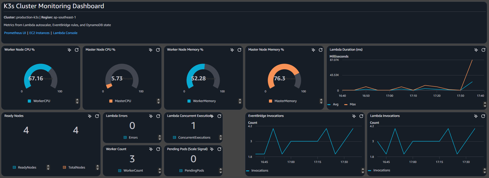

*Figure: CloudWatch dashboard showing K3s cluster CPU, memory, and node counts with gauge and single-value widgets.*

#### Dashboard Screenshot - Lambda Logs
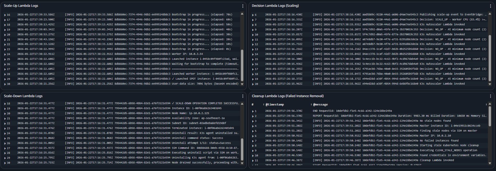

*Figure: CloudWatch Logs Insights showing error logs, scaling decisions, and Lambda execution logs across all four Lambda functions.*

### Fixed Log Group Names (v1.1)

All Lambda functions use explicit CloudWatch LogGroups with fixed names for stable dashboard references:

| Lambda Function | Log Group Name |
|-----------------|----------------|
| Decision Lambda | `/aws/lambda/k3s-autoscaler` |
| Scale-Up Lambda | `/aws/lambda/k3s-autoscaler-scale-up` |
| Scale-Down Lambda | `/aws/lambda/k3s-autoscaler-scale-down` |
| Cleanup Lambda | `/aws/lambda/k3s-autoscaler-cleanup` |

### Automated Dashboard Updates

After each Pulumi deployment, update the dashboard with new resource names:

```bash
cd monitoring/scripts
./update-dashboard.sh
```

This script queries AWS for current Lambda function names and updates log query paths.

### CloudWatch Alarms

| Alarm | Trigger | Purpose |
|-------|---------|---------|
| High CPU | CPU > 85% for 10min | Cluster under pressure |
| Scaling Failure | > 3 errors in 10min | Autoscaler malfunction |
| Lock Timeout | Lock held > 5min | Distributed lock issue |

## Testing

### Deploy Test Workloads

```bash
# CPU stress test
kubectl apply -f workloads/cpu-stress.yaml
kubectl scale deployment cpu-stress --replicas=10

# Pending pod test
kubectl apply -f workloads/pending-pod.yaml
kubectl scale deployment pending-pod-test --replicas=20

# Clean up
kubectl delete -f workloads/
```

### Manual Lambda Invocation

```bash
# Trigger decision Lambda
aws lambda invoke --function-name k3s-autoscaler-function \
  --payload '{"action": "health_check"}' \
  --cli-binary-format raw-in-base64-out \
  response.json && cat response.json
```

## Troubleshooting

### Check Scaling Logs

```bash
# Decision Lambda logs
aws logs tail /aws/lambda/k3s-autoscaler-function --follow

# Scale-Up Lambda logs
aws logs tail /aws/lambda/scale-up-lambda --follow

# Scale-Down Lambda logs
aws logs tail /aws/lambda/scale-down-lambda --follow
```

### Check Cluster State

```bash
# Query DynamoDB for current state
AWS_PROFILE=k3s-temp-user aws dynamodb scan \
  --table-name k3s-cluster-state \
  --region ap-southeast-1
```

### Check WAL for Stuck Operations

```bash
# Query WAL for incomplete operations
AWS_PROFILE=k3s-temp-user aws dynamodb scan \
  --table-name k3s-scaling-wal \
  --filter-expression "attribute_not_exists(completed_at)" \
  --region ap-southeast-1
```


## Predictive Scaling (Layer 4: Pipeline Complete, Deployed via CronJob)

The predictive scaling feature uses machine learning to forecast future CPU usage and proactively scale workers before traffic spikes occur. This completes the layered autoscaling architecture:

- **Layer 1 (v1.1)**: Data Collection - Gathers metrics and scaling history for ML training
- **Layer 2 (v1.1)**: Time-Aware Scaling - Different thresholds for peak/off-peak hours
- **Layer 3 (v1.1)**: Flash Sale Detection - Emergency response to sudden CPU spikes
- **Layer 4 (v1.2 - Roadmap)**: Predictive Scaling - Forecast CPU 15 minutes ahead using Prophet models

This predictive layer complements the existing reactive scaling (Layers 2-3) by adding proactive pre-scaling before traffic spikes occur.

### Training Pipeline Architecture

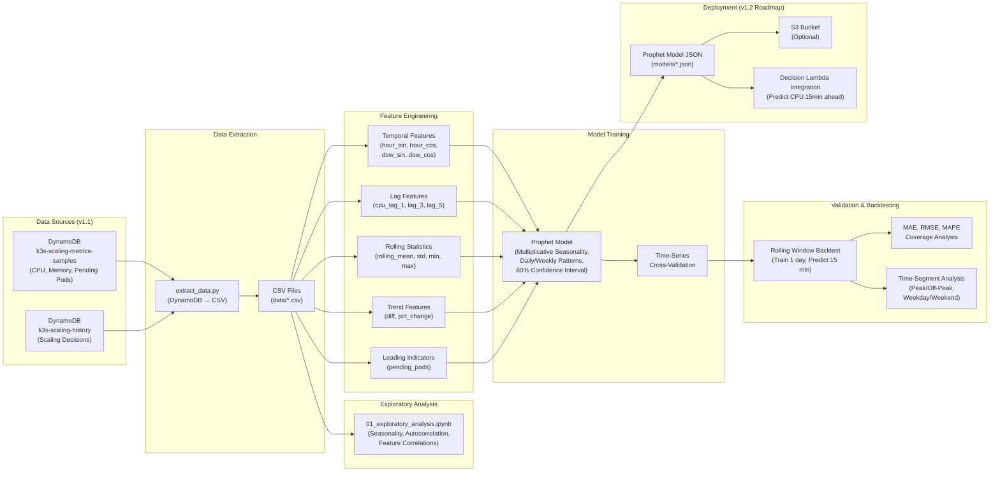

### Production CronJob Deployment

The ML training pipeline runs as a **Kubernetes CronJob** on the K3s cluster, automating model retraining every week.

#### Deployment Architecture

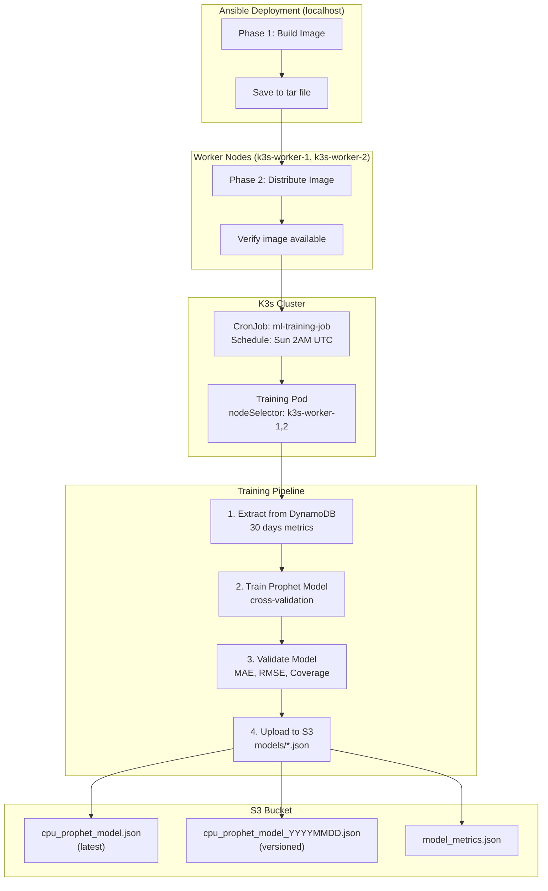

#### Three-Phase Ansible Deployment

**Phase 1: Build Docker Image (localhost)**
1. Build `k3s-ml-training:latest` from `ml_training/Dockerfile`
2. Include AWS CLI v2, Python dependencies, training scripts
3. Save image to tar file (`ml-training-image.tar`)
4. Store temp directory path as Ansible fact for distribution

**Phase 2: Distribute to Workers (worker nodes, `serial: 1`)**
Using `serial: 1` (one worker at a time for safety):
1. Copy tar file from localhost to each worker
2. Load image with `docker load`
3. Verify image availability
4. Cleanup tar file

**Phase 3: Deploy CronJob (localhost)**
1. Create `k3s-autoscaler` namespace
2. Create `ml-training-sa` ServiceAccount
3. Create AWS credentials secret (if not using instance profile)
4. Apply CronJob manifest with node selector
5. Verify deployment

#### Node Selector Strategy

**Critical Design**: ML training pods are pinned to **permanent worker nodes** to prevent interruption during scale-down operations.

| Worker Type | Scale-Down Protection | ML Training |
|-------------|----------------------|-------------|
| `k3s-worker-1` | ✅ Permanent | ✅ Eligible |
| `k3s-worker-2` | ✅ Permanent | ✅ Eligible |
| `k3s-worker-3+` | ❌ Temporary (LIFO) | ❌ Not eligible |

This ensures:
- Training jobs never interrupted by autoscaler
- Round-robin scheduling between permanent workers
- Predictable resource allocation

#### CronJob Configuration

The CronJob runs on a weekly schedule (Sunday 2 AM UTC) with:
- **Concurrency Policy**: Forbid (don't start if previous job running)
- **Backoff Limit**: 1 retry on failure
- **Timeout**: 90 minutes maximum
- **Resource Limits**: 500m-2000m CPU, 2Gi-4Gi memory
- **History**: Keeps 3 successful and 3 failed job records

#### Training Pipeline Steps

**Step 1: Extract Data from DynamoDB**
Extracts 30 days of cluster metrics from DynamoDB:
- CPU utilization history
- Memory usage patterns
- Worker count changes
- Scaling events

**Step 2: Train Prophet Model**
Trains Facebook Prophet model with:
- Daily and weekly seasonality
- Changepoint detection for workload shifts
- Cross-validation (rolling forecast)
- MAE/RMSE metrics

**Step 3: Validate Model**
Validates model performance:
- Forecast accuracy metrics
- Residual analysis
- Trend detection
- Coverage intervals

**Step 4: Upload to S3**
- Upload versioned model with timestamp
- Upload as latest (for Decision Lambda)
- Upload validation metrics
- Publish MAE/RMSE to CloudWatch

#### Integration with Decision Lambda

The trained model is automatically used by the Decision Lambda for predictive scaling:
1. Lambda loads model from S3 (`cpu_prophet_model.json`)
2. At each evaluation cycle, model predicts CPU 15 minutes ahead
3. Prediction used for scale-up decisions (proactive)
4. Current CPU still used for scale-down (conservative)
5. Graceful fallback to reactive scaling if model fails

#### Monitoring

**CloudWatch Metrics:**
- Namespace: `K3sAutoscalerML`
- Metrics: TrainingMAE, TrainingRMSE
- Dimension: ModelVersion

**S3 Model Storage:**
```
s3://k3s-models/models/
├── cpu_prophet_model.json                    # Latest model
├── cpu_prophet_model_YYYYMMDD.json          # Versioned model
└── cpu_prophet_model_YYYYMMDD_metrics.json  # Validation metrics
```

### Implementation Overview

**Training Pipeline** (builds on Layer 1 data collection)
- Extracts historical data from DynamoDB to CSV files
- Exploratory analysis (Jupyter notebook) identifies patterns: daily/weekly seasonality, autocorrelation, feature correlations
- Feature engineering creates temporal features (cyclical hour/day encoding), lag features (past CPU values), rolling statistics, trends, and leading indicators (pending pods)
- Prophet model trained with multiplicative seasonality (scales with load magnitude), daily/weekly patterns, 80% confidence intervals
- Time-series cross-validation prevents data leakage
- Model artifacts saved as JSON (portable, version-controllable)

**Validation & Backtesting**
- Rolling window backtest simulates real-time forecasting (train on 1 day, predict 15 min, roll forward)
- Metrics calculated: MAE, RMSE, MAPE, prediction interval coverage
- Segmented analysis by time period (peak vs off-peak, weekday vs weekend, hourly breakdown)
- Visualization of actual vs predicted, error distribution, metrics by period
- Validates that model performs consistently across all time periods

**Deployment Integration**
- Trained model loaded from S3 or local storage into Decision Lambda memory
- At each evaluation cycle (every 2 minutes), model predicts CPU 15 minutes ahead
- Prediction used as additional signal in scaling decision logic
- Graceful fallback to reactive scaling if model prediction fails or confidence low
- Model version tracked in DynamoDB state for rollbacks

**Monitoring & Retraining**
- Model performance monitored via CloudWatch metrics (prediction error, coverage)
- Retrain weekly with latest 30 days of data to capture pattern changes
- Drift detection: alert if MAE increases by >20% from baseline
- A/B testing: compare predictive vs reactive scaling before full rollout

### Files and Structure

Located in `ml_training/` directory:
- `scripts/extract_data.py` - Pulls historical data from DynamoDB
- `scripts/train_model.py` - Trains Prophet model with cross-validation
- `scripts/validate_model.py` - Backtesting and performance analysis
- `utils/feature_engineer.py` - Temporal, lag, rolling, and trend features
- `notebooks/01_exploratory_analysis.ipynb` - EDA for seasonality analysis
- `pyproject.toml` - uv dependencies (prophet, pandas, boto3, matplotlib)

### Exploratory Data Analysis

Before training the model, we analyzed 30 days of mock metrics to identify patterns and inform feature engineering:

**Time Series Patterns**

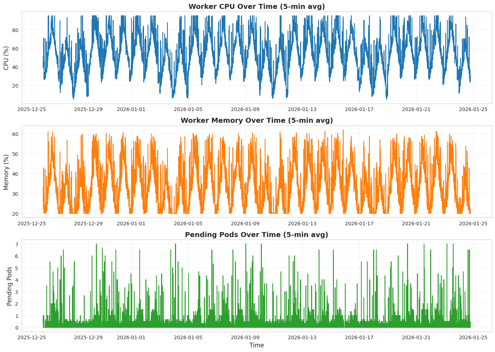

*Fig 1. Raw CPU time series showing daily cycles, weekly seasonality (weekends lower), and occasional spikes (flash sales).*

**Daily & Weekly Seasonality**

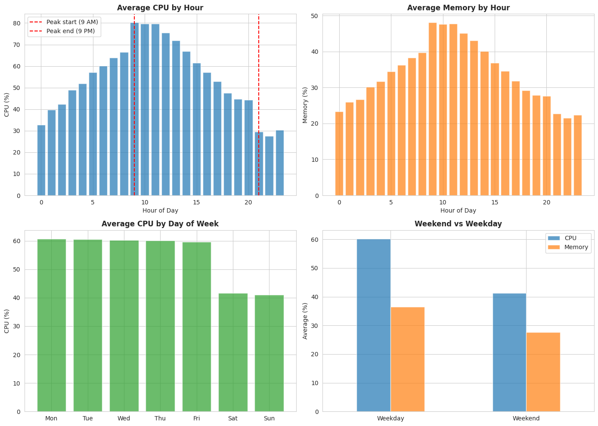

*Fig 2. Average CPU by hour (left) and day of week (right). Peak hours 9AM-9PM show ~40% higher CPU than off-peak. Weekends are ~30% lower than weekdays.*

**Scaling Decision Analysis**

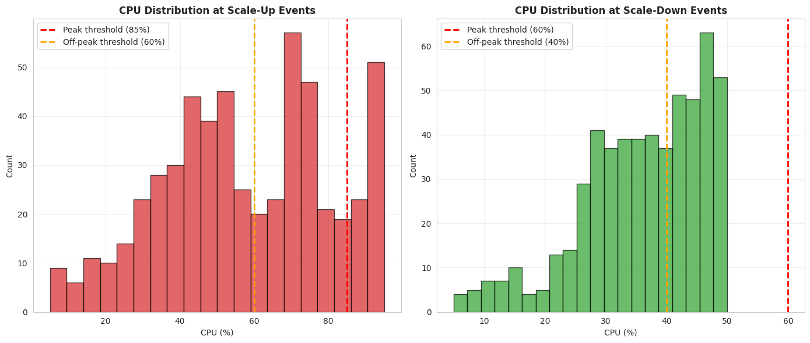

*Fig 3. CPU distribution by scaling decision. Scale-up decisions occur at higher CPU levels, while scale-down happens during sustained low CPU periods.*

**Correlation Analysis**

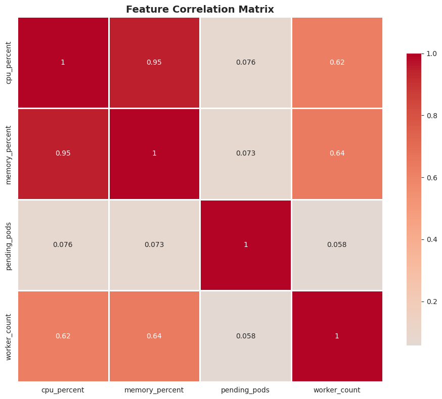

*Fig 4. Correlation heatmap showing CPU's relationship with other metrics. Memory (0.71) and pending_pods (0.52) are moderately correlated, making them useful regressors.*

**Predictability Assessment**

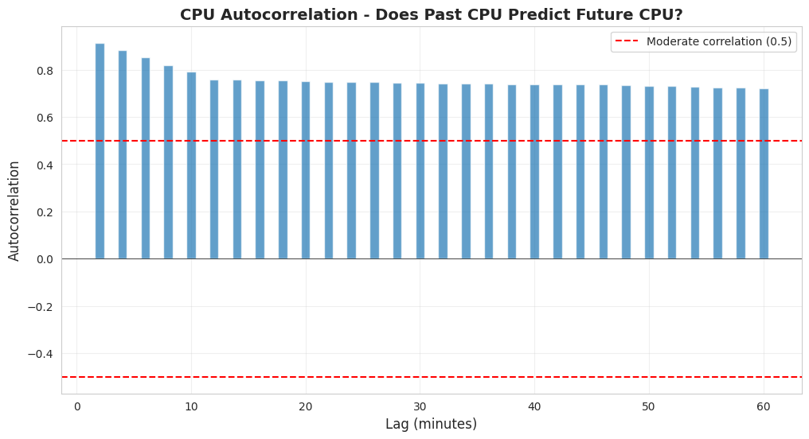

*Fig 5. Autocorrelation (ACF) and partial autocorrelation (PACF) plots. Strong correlation at lag 1-2 indicates past CPU values predict future values - justifying lag features.*

### Model Performance (Mock Data Baseline)

Tested with 30 days of synthetic metrics data generated to simulate realistic cluster patterns:

**Overall Metrics**
| Metric | Value | Target | Status |
|--------|-------|--------|--------|
| MAE | 8.76% | <10% | ✅ Pass |
| RMSE | 12.10% | - | Baseline |
| MAPE | 20.57% | <20% | ⚠️ Slightly above |
| Coverage | 78.78% | 75-85% | ✅ Pass |
| Bias | +0.45% | ~0% | Slight over-prediction |

**Performance by Time Period**
| Period | MAE | MAPE | Notes |
|--------|-----|------|-------|
| Peak Hours (9AM-9PM) | 8.01% | 13.59% | ✅ Best accuracy when it matters most |
| Weekdays | 8.56% | 15.89% | ✅ Strong performance |
| Off-Peak Hours | 9.51% | 27.55% | ⚠️ Higher error (low CPU variance) |
| Weekends | 9.22% | 31.29% | ⚠️ Less training data |

**Key Insights**
- Model performs **better during peak hours and weekdays** - ideal for autoscaling use case
- Off-peak and weekend periods show higher MAPE due to lower CPU values (higher relative variance)
- Confidence interval coverage (78.8%) aligns with 80% target
- Slight positive bias means model tends to over-predict, which is safer for autoscaling (scale up early rather than late)

**Validation Visualizations**

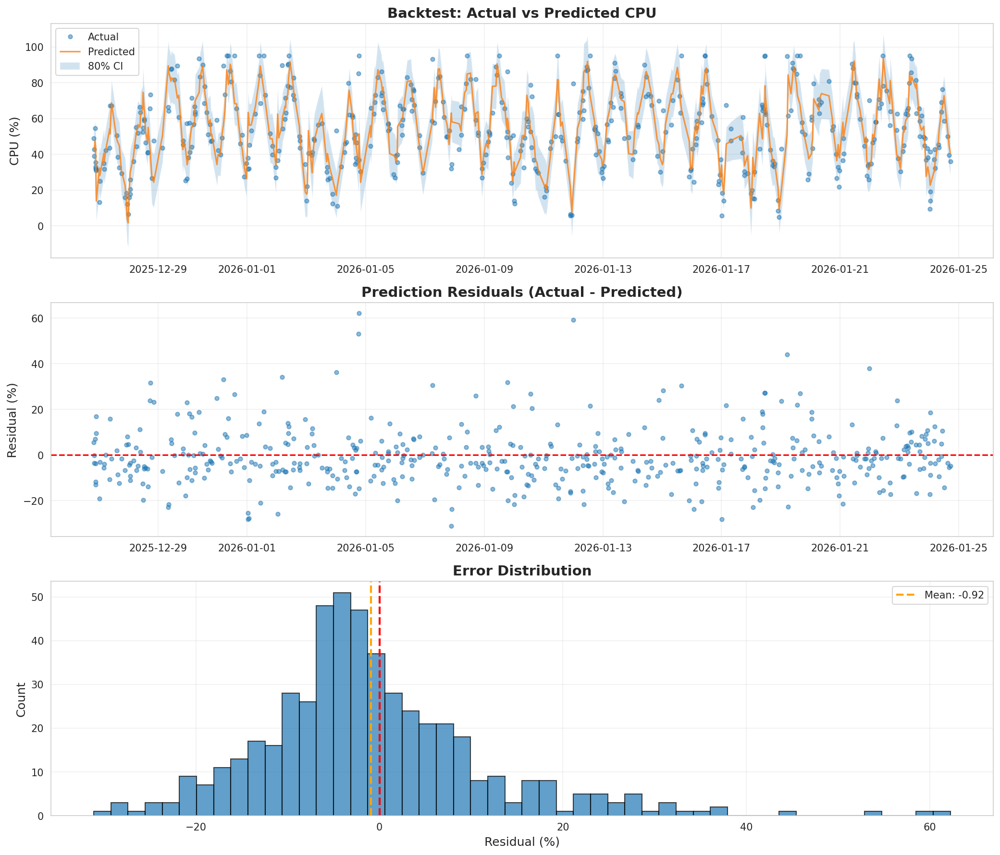

*Fig 1. Rolling backtest showing actual vs predicted CPU over 30 days. The model captures daily/weekly seasonality patterns with 80% confidence intervals (shaded area).*

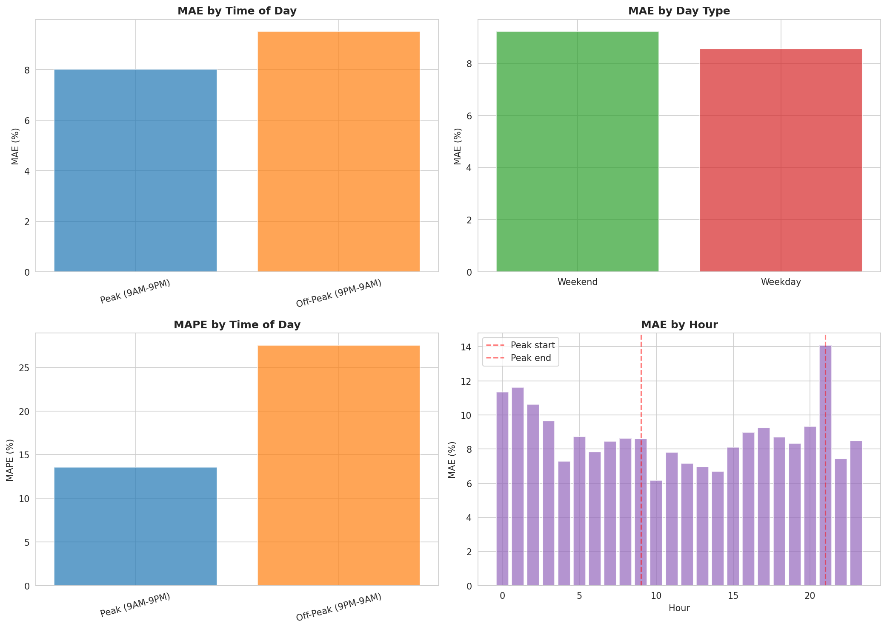

*Fig 2. Model performance segmented by time period. Peak hours (9AM-9PM) and weekdays show lower error rates, which is ideal for autoscaling since high-load periods need the most accurate predictions.*

> **Note**: These results are from synthetic data for pipeline validation. Production performance will vary based on actual workload patterns. Monitor MAE and coverage after deployment to establish production baseline.

### Success Criteria

- **MAE < 10%**: Prediction error within 10 percentage points
- **Coverage 75-85%**: Actual values fall within 80% confidence interval at expected rate
- **No time-period degradation**: Peak-hour MAE within 20% of overall MAE
- **Positive ROI**: Pre-scaling reduces SLA violations enough to justify ML infrastructure cost

## Future Improvements

| Feature | Description | Benefit |
|---------|-------------|---------|
| **Custom App Metrics** | Incorporate application-level metrics (queue depth, latency, error rates) into scaling decisions | More accurate scaling based on actual load |
| **GitOps Configuration** | Version-controlled configuration with auditable rollbacks via Git | Change management, traceability, safer deployments |

**Note:** Spot Instance Fallback with automatic On-Demand fallback, Multi-AZ worker distribution, Predictive Scaling (Layer 4) with automated model retraining, and Slack webhook subscription are already implemented.

### Implementation Priority

**Medium Priority:**
- Custom App Metrics (scaling accuracy)
- GitOps Configuration (operational excellence)

## Recent Enhancements


**v1.4 - ML Image Slimming + Real-AWS Validation (Latest)**

| Feature | Description |
|---------|-------------|
| **Multi-stage Dockerfile** | `builder` stage holds build-essential + the AWS CLI v2 bundle + pip cache; `runtime` stage is a clean `python:3.11-slim` that only copies `/app/.venv`. No build toolchain ships in the runtime image. |
| **Drop AWS CLI + jq from the image** | Pipeline was rewritten to use `boto3.client('s3').upload_file(...)` and `boto3.client('cloudwatch').put_metric_data(...)` instead of `aws s3 cp` / `aws cloudwatch put-metric-data`. JSON parsing moved from `jq` to the stdlib `json` module. |
| **`prophet` installed with `--no-deps`** | Bypasses the matplotlib hard dependency in prophet's METADATA so PIL / pillow.libs / kiwisolver / fontTools / contourpy / mpl_toolkits are not pulled in. Prophet's forecasting pipeline (`fit`, `predict`, `cross_validation`, `model_to_json`/`model_from_json`) doesn't need matplotlib. |
| **Image size 1.45 GB → 566 MB** | ~61% reduction. Compressed tar drops from 235 MB → 125 MB. Same forecasting output, headless container. |
| **3-way Ansible role runtime fix** | `kubernetes.core.k8s` and `kubectl apply` now respect a `kubeconfig_path` var (default `/etc/rancher/k3s/k3s.yaml`); needed because k3s installs the kubeconfig as `0600 root:root` and the Ansible user can't read it. |
| **Pipeline runs on real AWS** | Manual 1+2 cluster (master + 2 permanent workers, `t3.small`) in `poridhi-aws` account. CronJob `ml-training-job` schedules weekly retraining; `kubectl create job --from=cronjob/ml-training-job` triggers an on-demand run. Pod scheduled via `nodeAffinity` against the `k3s-worker=<name>` label applied by the worker bootstrap `--node-label` fix. |
| **`extract_data.py` profile fix** | Default `--profile=k3s-temp-user` doesn't exist inside the container; pipeline now passes `--profile ""` so boto3 falls back to the `AWS_ACCESS_KEY_ID` / `AWS_SECRET_ACCESS_KEY` env vars injected from the `aws-credentials` k8s Secret. |

**Key fixes (this session):** `kubernetes.core.k8s` rejected `data:`/`type:` keys → use `definition:` · `kubectl apply` `0600` kubeconfig → copy to `~/.ssh` with `chmod 600` and pass `--kubeconfig=` · `extract_data.py` flaky profile resolution → `--profile ""` works against the container's env vars · `nodeSelector` comma list → `nodeAffinity` with `operator: In` plus a Jinja `split(',')` list · worker bootstrap now reads its own `Name` tag and conditionally passes `--node-label "k3s-worker=$NAME"` to `k3s agent`.

**v1.3 - Fast Worker Bootstrap with Pre-Baked AMI**

| Feature | Description |
|---------|-------------|
| **Pre-Baked AMI** | K3s binary, SSM Agent, awscli, curl, jq, ca-certificates pre-installed. Bootstrap downloads nothing. |
| **k3s-worker-preinstall role** | Ansible role installs all dependencies except k3s binary |
| **k3s-agent-binary role** | Ansible role installs k3s as agent (not server) to avoid port 6443 conflicts |
| **worker-bake.yml** | Standalone playbook: launch temp instance → provision → snapshot AMI → write SSM → terminate |
| **Bake integrated in site.yml** | AMI bake section in main playbook, enabled via `bake_ami=true` flag |
| **Bootstrap ~91s → ~30s** | Eliminates curl\|sh install step per launch |
| **Auto-detect network iface** | `PRIMARY_IFACE=$(ip route show default \| awk '{print $5}')` handles both ens5 and eth0 |
| **Lambda SSM-only AMI** | Removed `AMI_ID` env var fallback; reads from `/k3s/{cluster_name}/worker-ami-id` only |

**Key fixes:** `unable to find interface eth0` (ens5 on ENA) · `token must not be empty` (wrong Secrets Manager query, removed `--token-file=/dev/null`)

**Bake:** `AWS_PROFILE=k3s-temp-user ansible-playbook site.yml -i inventory/hosts.ini -e bake_ami=true`

**v1.2 - ML Training Pipeline + Predictive Scaling (Latest)**

| Feature | Description |
|---------|-------------|
| **Data Extractor** | DynamoDB extraction script (`ml_training/scripts/extract_data.py`) pulls historical metrics and scaling decisions to CSV for training |
| **Feature Engineering** | Creates temporal features (cyclical encoding), lag features, rolling statistics, trends, and leading indicators (`ml_training/utils/feature_engineer.py`) |
| **Prophet Model Trainer** | Time-series forecasting model with multiplicative seasonality, daily/weekly patterns, 80% confidence intervals (`ml_training/scripts/train_model.py`) |
| **Validation & Backtesting** | Rolling window backtest, time-segmented analysis (peak/off-peak, weekday/weekend), prediction interval coverage (`ml_training/scripts/validate_model.py`) |
| **EDA Notebook** | Exploratory analysis for seasonality, autocorrelation, and feature correlations (`ml_training/notebooks/01_exploratory_analysis.ipynb`) |
| **CronJob Deployment** | Kubernetes CronJob runs weekly (Sunday 2 AM UTC) on permanent workers, uploads trained models to S3 |
| **Decision Lambda Integration** | Asymmetric predictive scaling: predicted CPU for scale-up (proactive), current CPU for scale-down (conservative) |

**Status**: Layer 4 complete and deployed. CronJob schedules automated training, Decision Lambda uses predictions for proactive scaling.

**v1.1 - Layered Autoscaling Architecture**

| Feature | Description |
|---------|-------------|
| **Time-Aware Scaling** | Different CPU thresholds for peak (9 AM - 9 PM) vs off-peak hours. Peak: 85%/60% thresholds. Off-peak: 60%/40% thresholds. |
| **Flash Sale Detection** | Emergency response when CPU spikes >30% within 2 minutes. Overrides cooldown for immediate scale-up. |
| **Data Collection for ML** | Records all scaling decisions and periodic metrics samples to DynamoDB for future ML-based predictive scaling. |
| **Permanent Worker Protection** | Fixed bug where autoscaler used `total_nodes` instead of `worker_count`, preventing scale-down of permanent workers. |
| **Fixed CloudWatch Log Groups** | Explicit LogGroup resources with fixed names for stable dashboard references. |

**v1.0 - Initial Release**

| Feature | Description |
|---------|-------------|
| **Event-Driven Lambda Architecture** | Decision Lambda triggered every 2 minutes via EventBridge, with Scale-Up/Down/Cleanup Lambdas chained via events |
| **DynamoDB State Management** | Cluster state, WAL for crash recovery, and distributed locking using conditional writes |
| **Multi-AZ Worker Distribution** | Round-robin subnet selection across 3 availability zones for high availability |
| **LIFO Scale-Down Strategy** | Last In, First Out removal with permanent worker protection (k3s-worker-1, k3s-worker-2) |
| **Spot Instances with Fallback** | Automatic On-Demand fallback when spot capacity unavailable (InsufficientInstanceCapacity, SpotInstanceCapacityNotAvailable, MaxSpotInstanceCountExceeded) |
| **Graceful Node Drain** | kubectl drain with 120s timeout via SSM before terminating workers |
| **Cleanup Lambda** | Removes failed EC2 instances (JoinStatus not verified after 5 min) and stale Kubernetes nodes (NotReady) |
| **CloudWatch Alarms** | 17 alarms for Lambda health, infrastructure metrics, EventBridge failures, and DLQ monitoring |
| **Prometheus Integration** | Queries in-cluster Prometheus (NodePort 30900) for worker CPU/memory metrics |
| **Standard Scaling Logic** | Scale-up on CPU OR pending pods; Scale-down on CPU AND memory with cooldowns (5min up, 15min down) |
## License
MIT