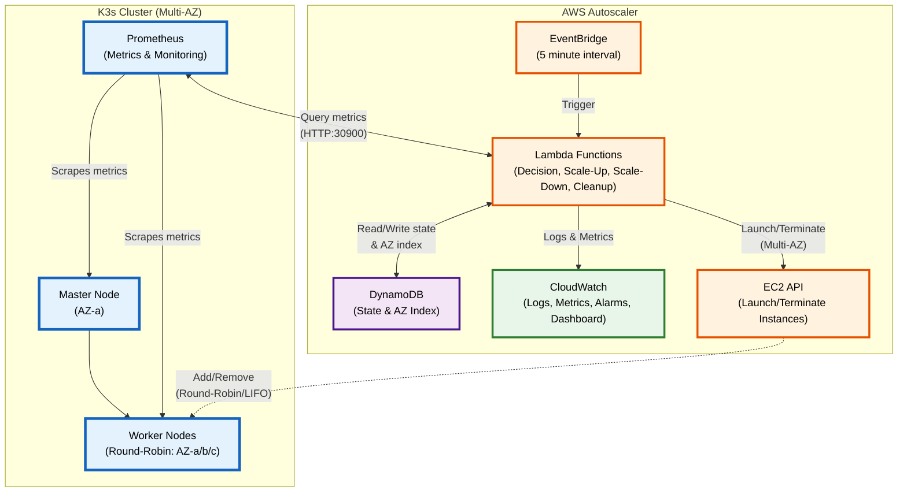
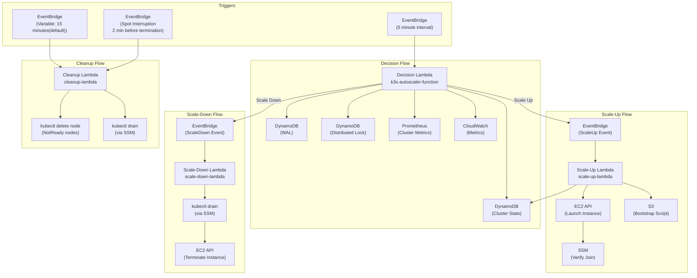

# ElastiKube

Production-grade autoscaling system for K3s clusters on AWS using event-driven Lambda architecture, DynamoDB state management, and EC2.

## Project Overview

This autoscaler monitors K3s cluster metrics via Prometheus and automatically scales worker nodes based on CPU, memory, and pod scheduling pressure. It uses an event-driven architecture with Lambda functions orchestrated through EventBridge for fault tolerance and retry capabilities.

### System Architecture



## Key Components

| Component | Purpose | Technology |
|-----------|---------|------------|
| **Decision Lambda** | Makes scaling decisions based on metrics | Python 3.11, Prometheus API |
| **Scale-Up Lambda** | Launches new EC2 worker instances | Python 3.11, EC2 API |
| **Scale-Down Lambda** | Drains and terminates workers | Python 3.11, kubectl via SSM |
| **Cleanup Lambda** | Stale node cleanup every 15 minutes | Python 3.11, EC2 API |
| **State Management** | Distributed locking & cluster state | DynamoDB (2 tables) |
| **WAL** | Write-Ahead Log for crash recovery | DynamoDB |
| **EventBridge** | Orchestrates Lambda chaining | AWS EventBridge |
| **Metrics Collection** | Cluster metrics scraping | Prometheus (in-cluster) |
| **Token Storage** | K3s join token & bootstrap scripts | AWS S3 |
| **Monitoring** | Logs, metrics, dashboards | CloudWatch |


## Architecture


### Scaling Decision Flow


### Scaling Logic

The Decision Lambda evaluates scaling conditions in a specific order defined in `decision-lambda/src/scaler/scaling.py`:

**Evaluation Order:**
1. **Flash Sale Detection** (emergency response, overrides cooldown)
2. Check scale-up cooldown (blocks all scale-up if active)
3. Check scale-up conditions (CPU OR pending pods)
4. If scale-up not triggered, check scale-down cooldown (blocks only scale-down)
5. Check scale-down conditions (CPU AND memory both low)

#### Layer 3: Flash Sale Detection (Emergency Response)

Before any cooldown checks, the system detects sudden CPU spikes:
- **Trigger**: CPU increase > 30% within 2 minutes
- **Action**: Immediate scale-up, bypasses all cooldowns
- **Purpose**: Handle sudden traffic surges (e.g., flash sales, viral content)

#### Layer 2: Time-Aware Scaling

The autoscaler uses different CPU thresholds based on time of day:

| Time Period | Hours | Scale-Up Threshold | Scale-Down Threshold |
|-------------|-------|-------------------|---------------------|
| **Peak** | 9 AM - 9 PM | 85% | 60% |
| **Off-Peak** | 9 PM - 9 AM | 60% | 40% |

**Why Time-Aware?**
- Peak hours have higher baseline CPU (70-80%), so thresholds are raised
- Prevents threshold thrashing (constant scale-up/down at boundary)
- Off-peak hours use lower thresholds for faster response to increased load

#### Standard Scaling Logic

**Scale UP when ALL of these conditions are met:**
- NOT in scale-up cooldown (default: 300 seconds)
- AND (Worker CPU >= time-aware threshold OR Pending pods >= 1)
- AND Current worker nodes < max_nodes (default: 10)
  - **Note**: Uses `worker_count` (excludes master), NOT `total_nodes`

**Scale DOWN when ALL of these conditions are met:**
- NOT in scale-down cooldown (default: 900 seconds)
- AND Worker CPU < time-aware threshold
- AND Worker Memory < 50% (hardcoded threshold, not configurable)
- AND Current worker nodes > min_nodes (default: 2)
  - **Note**: Uses `worker_count` (excludes master), NOT `total_nodes`

**Important Notes:**
- Scale-up and scale-down cannot both occur in the same evaluation cycle
- Pending pods condition takes precedence and can trigger scale-up even during scale-down cooldown
- The scale-down memory threshold (50%) is hardcoded in the scaling engine and not configurable via environment variables
- Node count checks use `worker_count` from Kubernetes, which **excludes** the master/control-plane node (v1.1 fix)

### Cooldown Behavior

- **Scale-up cooldown**: Checked first, blocks ALL scale-up operations when active
- **Scale-down cooldown**: Checked after scale-up evaluation, only blocks scale-down operations
- **Pending pods override**: The presence of pending pods (>= 1) can trigger scale-up even when in scale-down cooldown
- **Cooldown calculation**: Based on `last_scale_time` timestamp in DynamoDB state, measured in seconds since last scaling operation
- **Default values**: 300 seconds (5 minutes) for scale-up, 900 seconds (15 minutes) for scale-down

### Distributed Lock

- Uses DynamoDB conditional writes (optimistic locking)
- Sets `scaling_in_progress=true` only if currently `false`
- 10 second timeout with 1-second retries
- If lock unavailable, returns `NO_OP` immediately
- Always released in `finally` block to prevent deadlocks

### Crash Recovery (WAL)

- Write-Ahead Log tracks all scaling operations
- Incomplete operations older than 10 minutes marked as FAILED
- Recent incomplete operations block new scaling
- Prevents duplicate operations after Lambda restart

### LIFO Scaling Strategy

The scale-down operation uses **LIFO (Last In, First Out)**:
1. Excludes permanent workers (tagged `Permanent=true`)
2. Prefers autoscaler-created workers (tagged `CreatedBy=autoscaler`)
3. Selects most recently launched worker
4. Executes `kubectl drain` before termination

## Lambda Function Details

### Event-Driven Lambda Chain



### Decision Lambda (`k3s-autoscaler-function`)

**Trigger:** EventBridge rule (5-minute interval)

**Key Responsibilities:**
1. Acquire distributed lock (10s timeout, 1s retries)
2. Check WAL for incomplete operations (crash recovery)
3. Fetch cluster metrics from Prometheus
4. Publish metrics to CloudWatch (`K3sAutoscaler` namespace)
5. Evaluate scaling decision
6. Publish EventBridge event if scaling needed
7. Update state with current `ready_nodes` count
8. Release distributed lock (always in `finally` block)

**Health Check:** Invoke with `{"action": "health_check"}`

### Scale-Up Lambda (`scale-up-lambda`)

**Trigger:** EventBridge `ScaleUp` events from decision Lambda

**Idempotency Layers (checked before launching):**
1. **Bootstrap credentials check** - SSM master IP + Secrets Manager join token
2. **Cooldown check** (3 min) - Prevents rapid successive scale-ups
3. **Scaling in progress check** - Persistent `scaling_in_progress` flag (auto-clears stale flags > 5 min)
4. **Pending instances check** - Looks for unverified instances < 5 min old
5. **Distributed lock** (200s timeout) - Prevents concurrent execution

**Launch Process:**
1. Select subnet using **round-robin** across multiple AZs for high availability
2. Fetch bootstrap script from S3 (`USER_DATA_S3_BUCKET/USER_DATA_S3_KEY`)
3. Launch EC2 instance with spot instance fallback:
   - **First attempt**: Launch Spot instance (70-90% cost savings) if `USE_SPOT_INSTANCES=true`
   - **Fallback**: If spot capacity unavailable (InsufficientInstanceCapacity, SpotInstanceCapacityNotAvailable, MaxSpotInstanceCountExceeded), automatically launch On-Demand instance at full price
   - **Tag updates**: `InstanceLifecycle` tag reflects actual instance type ("spot" or "on-demand")
4. Poll for `JoinStatus` tag (set by bootstrap script) every 10s (180s timeout)
5. Tag instance as `JoinVerified=true` on success
6. Update DynamoDB state with `last_scale_operation=SCALE_UP`, subnet ID, and availability zone

**Multi-AZ Round-Robin Distribution:**
- Scaled workers are distributed across 3 AZs using round-robin selection
- DynamoDB tracks `last_subnet_index` to cycle through subnets: AZ-a → AZ-b → AZ-c → AZ-a...
- Each instance is tagged with `AvailabilityZone` and `SubnetId` for observability
- Master and permanent workers remain in AZ-a for control plane stability

**Instance Tags:**
- `Name`: `k3s-worker-{cluster_name}-{uuid}`
- `Cluster`: `{cluster_name}`
- `NodeRole`: `worker`
- `Permanent`: `false`
- `CreatedBy`: `autoscaler`
- `AvailabilityZone`: `ap-southeast-1a/b/c` (for observability)
- `SubnetId`: `subnet-xxx` (for observability)
- `JoinStatus`: `success`/`failed` (set by bootstrap script)
- `JoinVerified`: `true` (set by Lambda after verification)

**Manual Actions:** `launch`, `describe`, `terminate`

### Scale-Down Lambda (`scale-down-lambda`)

**Trigger:** EventBridge `ScaleDown` events from decision Lambda, or direct invocation

**Supported Actions:**
- `list` - List all worker instances
- `describe` - Describe specific worker details
- `drain` - Drain a worker node via kubectl (SSM, 120s timeout)
- `terminate` - Terminate a worker instance (runs uninstall first)
- `scale_down` - Execute LIFO scale-down

**LIFO Scale-Down Strategy:**
1. List all workers (filter by `Cluster` and `NodeRole=worker` tags)
2. Exclude permanent workers (`Permanent=true` tag)
3. Sort by launch time (most recent first)
4. Prefer autoscaler-created workers (`CreatedBy=autoscaler` tag)
5. Log selected worker's **availability zone** and **subnet** for observability
6. Execute `kubectl drain --ignore-daemonsets --delete-emptydir-data --timeout=120s` via SSM
7. Run `k3s-agent-uninstall.sh` via SSM (graceful K3s agent removal)
8. Terminate EC2 instance
9. Update DynamoDB state with new `node_count`

**Multi-AZ Behavior:**
- LIFO naturally complements round-robin scale-up
- Most recent worker (selected for removal) is likely in a different AZ each time
- AZ and subnet information logged for each scale-down operation
- No special AZ-aware logic needed - LIFO maintains distribution balance

**Node Name Format:** `ip-{private_ip}` (e.g., `ip-10.0.2.42`)

### Cleanup Lambda (`cleanup-lambda`)

**Trigger:** EventBridge (rate 5 minutes), Spot Interruption Warnings, or manual invocation

**Supported Actions:**
- `health_check` - Health check endpoint
- `clean_stale_nodes` - Remove NotReady K8s nodes only

**Phase 1 - Failed EC2 Instance Cleanup:**
Finds instances that:
- Have `CreatedBy=autoscaler` tag
- Running for > 5 minutes (`MAX_INSTANCE_AGE_MINUTES` env var)
- No `JoinVerified=true` tag OR `CleanupRequired=true` tag

Uses SSM to verify node actually joined cluster (runs `check-node-by-ip.sh` on master) before terminating.

**Phase 2 - Stale Kubernetes Node Cleanup:**
- Runs `kubectl get nodes --no-headers | grep NotReady` via SSM
- Deletes each NotReady node individually via `kubectl delete node`
- Returns summary of deleted/failed nodes

**Spot Instance Interruption Handler:**
- Triggered 2 minutes before spot termination by EventBridge
- Extracts instance ID from event detail
- Finds node by private IP via `kubectl get nodes -o wide`
- Executes `kubectl drain --timeout=90s --force` and `kubectl delete node`
- Tags instance with `SpotInterruptionHandled=true`

**Default Schedule:** Every 15 minutes via EventBridge

## Infrastructure

The AWS infrastructure is defined in `infrastructure/pulumi/__main__.py` using Pulumi (Infrastructure as Code). Below is a summary of the provisioned resources:

```mermaid
graph TB
    Internet["🌐 Internet / Users"]
    
    subgraph VPC["AWS VPC (10.0.0.0/16) - ap-southeast-1"]
        direction TB
        
        IGW["Internet Gateway"]
        
        subgraph Subnets["Multi-AZ Subnets"]
            direction LR
            
            subgraph Public["Public Subnet<br/>(10.0.1.0/24, AZ-a)"]
                Bastion["Bastion<br/>t3.micro<br/>10.0.1.10"]
                NAT["NAT Gateway<br/>(Elastic IP)"]
            end
            
            subgraph AZa["Private Subnet AZ-a<br/>(10.0.2.0/24)"]
                subgraph Master["Master<br/>t3.small<br/>10.0.2.10"]
                    
                end
                subgraph Worker12["EC2 Workers 1-2<br/>t3.small<br/>Permanent"]
                end
                Workers3["Autoscaled<br/>EC2 Worker"]
            end
            
            subgraph AZb["Private Subnet AZ-b<br/>(10.0.3.0/24)"]
                subgraph WorkersB["Autoscaled<br/>EC2 Worker"]
                end
            end
            
            subgraph AZc["Private Subnet AZ-c<br/>(10.0.4.0/24)"]
                WorkersC["Autoscaled<br/>EC2 Worker"]
            end
        end
        
        SG["Security Group<br/>k3s-cluster-secgrp"]
        
        subgraph LambdaSubnet["Lambda VPC Attachment (Private AZ-a)"]
            Decision["Decision Lambda<br/>256MB, 300s"]
            ScaleUp["Scale-Up Lambda<br/>256MB, 300s"]
            ScaleDown["Scale-Down Lambda<br/>256MB, 300s"]
            Cleanup["Cleanup Lambda<br/>128MB, 60s"]
        end
    end
    
    subgraph AWS["AWS Managed Services (Outside VPC)"]
        direction TB
        
        subgraph Storage["Storage Services"]
            DynamoDB["DynamoDB<br/>PAY_PER_REQUEST<br/>cluster-state + wal"]
            S3["S3 Bucket<br/>worker-userdata"]
            Secrets["Secrets Manager<br/>K3s join token"]
            SSM["SSM Parameter<br/>Master IP"]
        end
        
        subgraph Events["EventBridge"]
            EB["EventBridge<br/>Rules + Schedules"]
        end
        
        subgraph Monitor["Monitoring"]
            CloudWatch["CloudWatch<br/>Logs + Metrics<br/>+ Alarms"]
            SNS["SNS Topic<br/>Alarms"]
            DLQ["SQS DLQs"]
        end
    end
    
    %% Network Connectivity
    Internet -->|SSH :22| IGW
    IGW <-->|Public IP| Bastion
    IGW <-->|Elastic IP| NAT
    
    
    AZa -->|Route Table| NAT
    AZb -->|Route Table| NAT
    AZc -->|Route Table| NAT
    
        
    
    SG -.->|Protects| Master
    SG -.->|Protects| Worker12
    SG -.->|Protects| Workers3
    SG -.->|Protects| WorkersB
    SG -.->|Protects| WorkersC
    SG -.->|Protects| LambdaSubnet
    SG -.->|Protects| Bastion

        
    LambdaSubnet -->|HTTPS| DynamoDB
    LambdaSubnet -->|HTTPS| S3
    LambdaSubnet -->|HTTPS| Secrets
    LambdaSubnet -->|HTTPS| SSM
    LambdaSubnet -->|HTTPS| EB
    LambdaSubnet -->|HTTPS| CloudWatch

    
    EB -->|Invoke| LambdaSubnet
    CloudWatch -->|Notify| SNS
    EB -.->|Failed Events| DLQ
    
    %% Styling

    class VPC,Subnets,Public,AZa,AZb,AZc,LambdaSubnet vpcStyle
    class Bastion,Master,Worker12,WorkersB,WorkersC,Prom,NAT,IGW,SG ec2Style
    class Decision,ScaleUp,ScaleDown,Cleanup lambdaStyle
    class AWS,Storage,DynamoDB,S3,Secrets,SSM storageStyle
    class Monitor,CloudWatch,SNS,DLQ monitorStyle
    class Events,EB eventStyle
```



### VPC & Networking

| Resource | CIDR/IP | Purpose |
|----------|---------|---------|
| VPC | `10.0.0.0/16` | Main network for K3s cluster |
| Public Subnet | `10.0.1.0/24` | Bastion host (SSH access) |
| Private Subnet AZ-a | `10.0.2.0/24` | K3s master + permanent workers (ap-southeast-1a) |
| Private Subnet AZ-b | `10.0.3.0/24` | Scaled workers (ap-southeast-1b) |
| Private Subnet AZ-c | `10.0.4.0/24` | Scaled workers (ap-southeast-1c) |
| Internet Gateway | - | Public internet access |
| NAT Gateway | Elastic IP (AZ-a) | Outbound internet for all private subnets |
| Route Tables | 2 | Public/Private routing |

**Multi-AZ Architecture:**
- **3 private subnets** across different availability zones (ap-southeast-1a, ap-southeast-1b, ap-southeast-1c)
- **Single NAT Gateway** in AZ-a for cost optimization (all private subnets route to it)
- **Master and permanent workers** reside in AZ-a for consistent control plane availability
- **Scaled workers** distributed across all 3 AZs using **round-robin** for high availability
- **LIFO scale-down** removes most recent workers regardless of AZ, maintaining natural distribution balance

### Security Group (`k3s-cluster-secgrp`)

**Inbound Rules:**
- Port `22` (SSH) from `0.0.0.0/0` (restrict in production)
- Port `6443` (Kubernetes API) within VPC
- Port `30900` (Prometheus NodePort) within VPC
- Port `9090` (Prometheus) within VPC
- Port `8472` (Flannel VXLAN) within VPC
- Ports `30000-32767` (NodePort range) within VPC
- Port `9100` (Node Exporter) self
- Port `10250` (Kubelet) self

**Outbound:** All traffic allowed

### DynamoDB Tables

| Table | Purpose | Key Schema |
|-------|---------|------------|
| `k3s-cluster-state` | Cluster state, scaling status, locks | Hash: `cluster_id` |
| `k3s-scaling-wal` | Write-Ahead Log for crash recovery | Hash: `operation_id`, Range: `started_at` |

Both tables have:
- PAY_PER_REQUEST billing mode
- Point-in-time recovery enabled
- TTL enabled for automatic cleanup
- GSI indexes for querying by scaling status and incomplete operations

### Lambda Functions

| Lambda | Runtime | Memory | Timeout | VPC | Purpose |
|--------|---------|--------|---------|-----|---------|
| Decision Lambda | Python 3.11 | 256MB | 300s | Yes | Queries Prometheus, makes scaling decisions |
| Scale-Up Lambda | Python 3.11 | 256MB | 300s | Yes | Launches new EC2 worker instances |
| Scale-Down Lambda | Python 3.11 | 256MB | 300s | Yes | Drains & terminates worker nodes |
| Cleanup Lambda | Python 3.11 | 128MB | 60s | Yes | Removes failed/stale nodes |

All Lambdas share the same IAM role (`k3s-autoscaler-lambda-role`) with permissions for:
- EC2 (RunInstances, TerminateInstances, DescribeInstances, CreateTags)
- DynamoDB (CRUD on state and WAL tables)
- SSM (GetParameter, SendCommand for kubectl drain)
- EventBridge (PutEvents for Lambda chaining)
- CloudWatch (PutMetricData, Logs)
- Secrets Manager (Get K3s join token)
- S3 (Get bootstrap scripts)

### EventBridge Rules

| Rule | Trigger | Target | Detail Type |
|------|---------|--------|-------------|
| `k3s-autoscaler-schedule` | Every 2 minutes | Decision Lambda | - |
| `k3s-scale-up-rule` | ScaleUp event | Scale-Up Lambda | `k3s.autoscaler` |
| `k3s-scale-down-rule` | ScaleDown event | Scale-Down Lambda | `k3s.autoscaler` |
| `k3s-cleanup-schedule` | Every 15 minutes | Cleanup Lambda | - |
| `k3s-spot-interruption` | Spot termination warning (2 min) | Cleanup Lambda | EC2 Spot Interruption |

### EC2 Instances (Seed Nodes)

| Instance | Type | Private IP | Purpose |
|----------|------|------------|---------|
| Bastion | t3.micro | `10.0.1.10` | SSH jump host (public IP) |
| Master | t3.small | `10.0.2.10` | K3s control plane |
| Worker 1 | t3.small | `10.0.2.11` | Permanent worker |
| Worker 2 | t3.small | `10.0.2.12` | Permanent worker |

**Note:** Workers 1 and 2 are tagged with `Permanent=true` and excluded from scale-down operations.

### IAM Roles & Instance Profiles

| Role | Purpose | Attached Policies |
|------|---------|-------------------|
| `k3s-autoscaler-lambda-role` | Lambda execution | AWSLambdaBasicExecutionRole, AWSLambdaVPCAccessExecutionRole, custom policy |
| `k3s-worker-node-role` | Worker instance profile | AmazonSSMManagedInstanceCore, AWSSecretsManagerClientReadOnlyAccess, custom policy |
| `k3s-master-node-role` | Master instance profile | AmazonSSMManagedInstanceCore, SecretsManagerReadWrite, custom CloudWatch policy |

### SQS Dead Letter Queues

| Queue | Purpose | Retention |
|-------|---------|-----------|
| `k3s-scale-up-dlq` | Failed scale-up events | 14 days |
| `k3s-scale-down-dlq` | Failed scale-down events | 14 days |

### CloudWatch Alarms

#### Critical Failure Alarms (Lambda Health)

These alarms detect Lambda execution failures that prevent the autoscaler from functioning:

| Alarm | Severity | Trigger | Response Time |
|-------|----------|---------|---------------|
| Decision Lambda Errors | CRITICAL | Errors > 0 (5min) | Immediate |
| Scale-Up Lambda Errors | CRITICAL | Errors > 0 (5min) | Immediate |
| Scale-Down Lambda Errors | CRITICAL | Errors > 0 (5min) | Immediate |
| Decision Lambda Duration | WARNING | Duration > 240s (10min) | 10 minutes |
| Cleanup Lambda Errors | WARNING | Errors > 3 (10min) | 10 minutes |

#### Infrastructure Health Alarms

These alarms detect operational issues with the cluster:

| Alarm | Severity | Trigger | Response Time |
|-------|----------|---------|---------------|
| Pending Pods Stuck | CRITICAL | > 5 pods for 3min | Immediate |
| Node Count Below Min | CRITICAL | Nodes < 2 | 2 minutes |
| WAL Stale Operations | WARNING | Incomplete > 10min | 5 minutes |
| Master Memory | WARNING | Memory > 90% | 10 minutes |

#### Existing Monitoring Alarms

| Alarm | Metric | Threshold | Period |
|-------|--------|-----------|--------|
| High CPU | ClusterCPU > 85% | 2 periods | 5 min |
| Scaling Failure | ScalingErrors > 3 | 1 period | 10 min |
| Lock Timeout | LockAge > 300s | 1 period | 1 min |
| Provisioning Timeout | NodeProvisioningTime > 600s | 1 period | 1 min |
| Scale-Up EventBridge Failures | FailedInvocations > 0 | 1 period | 5 min |
| Scale-Down EventBridge Failures | FailedInvocations > 0 | 1 period | 5 min |
| DLQ Messages (both) | ApproximateNumberOfMessagesVisible > 0 | 1 period | 5 min |
| DLQ Age (both) | ApproximateAgeOfOldestMessage > 3600s | 1 period | 5 min |

#### Alarm Notifications

All alarms are configured to send notifications to an SNS topic for alerting:

| Resource | Purpose |
|----------|---------|
| SNS Topic | `k3s-autoscaler-alarms` (created during deployment) |
| Subscription | Email (must be configured - see below) |

**To receive alarm notifications:**

1. **During deployment** (automatic):
   ```bash
   pulumi config set alarm:email your-email@example.com
   pulumi up
   ```

2. **After deployment** (manual):
   ```bash
   pulumi stack output alarm_sns_subscribe_command
   # Example: aws sns subscribe --topic-arn arn:aws:sns:...:k3s-autoscaler-alarms-... --protocol email --notification-endpoint YOUR_EMAIL@example.com
   ```

3. **Verify subscription**: You'll receive a confirmation email. Click the link to activate notifications.

### Other Resources

| Resource | Name/Path | Purpose |
|----------|-----------|---------|
| SSM Parameter | `/k3s/{cluster_name}/master-ip` | Master node IP for worker join |
| Secrets Manager | `k3s-{cluster_name}-join-token` | K3s cluster join token (sensitive) |
| S3 Bucket | `k3s-userdata-{cluster_name}` | Worker bootstrap scripts |
| CloudWatch Dashboard | `K3s-Cluster-Comprehensive` | Metrics visualization |

### IAM Permissions and Security

ElastiKube uses a multi-layered IAM architecture with scoped permissions for each component. The complete IAM policy documentation is available in [docs/iam-policies.json](docs/iam-policies.json).

#### IAM Roles Summary

| Role | Purpose | Managed Policies | Inline Policies |
|------|---------|------------------|-----------------|
| **`k3s-autoscaler-lambda-role`** | Execution role for all 4 Lambda functions (Decision, Scale-Up, Scale-Down, Cleanup) | AWSLambdaBasicExecutionRole, AWSLambdaVPCAccessExecutionRole | autoscaler_core_policy, lambda_pass_role_policy |
| **`k3s-worker-node-role`** | IAM role for K3s worker EC2 instances (permanent and autoscaled) | AmazonSSMManagedInstanceCore, AWSSecretsManagerClientReadOnlyAccess | worker_node_policy |
| **`k3s-master-node-role`** | IAM role for K3s master/control-plane EC2 instance | AmazonSSMManagedInstanceCore, SecretsManagerReadWrite | master_cloudwatch_policy |

#### Deployment User

| User | Purpose | Policy | Restrictions |
|------|---------|--------|--------------|
| **`k3s-temp-user`** | Pulumi infrastructure deployment | `temp-user-policy` (managed) | Resource prefix scoping (`k3s-*`), regional boundary (`ap-southeast-1`), PassRole service restriction |

#### Lambda Execution Role Permissions

The `k3s-autoscaler-lambda-role` has the following key permissions:

| Service | Permissions | Purpose |
|---------|-------------|---------|
| **EC2** | RunInstances, TerminateInstances, DescribeInstances, CreateTags, Spot instance operations | Launch and terminate worker nodes |
| **DynamoDB** | Full CRUD on `k3s-cluster-state` and `k3s-scaling-wal` tables | State management and WAL |
| **SSM** | GetParameter, SendCommand, GetCommandInvocation | Retrieve master IP, execute kubectl drain |
| **EventBridge** | PutEvents, DescribeRule, ListRules | Lambda chaining, observability |
| **Secrets Manager** | GetSecretValue, DescribeSecret, UpdateSecretVersionStage | Retrieve K3s join token |
| **CloudWatch** | PutMetricData, logs:CreateLogGroup, logs:PutLogEvents | Metrics and logging |
| **S3** | GetObject on `k3s-userdata-*` buckets | Retrieve bootstrap scripts |
| **IAM** | PassRole (scoped to `k3s-worker-node-role`) | Attach instance profile to workers |

#### Worker Node Role Permissions

| Service | Permissions | Purpose |
|---------|-------------|---------|
| **DynamoDB** | UpdateItem, PutItem on state table | Update node status and heartbeat |
| **SSM** | GetParameter on `/k3s/*` | Retrieve master IP for cluster join |
| **EC2** | DescribeInstances, DescribeTags, CreateTags | Tag own instance during bootstrap |
| **Secrets Manager** | Read-only via managed policy | Retrieve K3s join token |

#### Master Node Role Permissions

| Service | Permissions | Purpose |
|---------|-------------|---------|
| **CloudWatch** | PutMetricData, logs operations | Publish metrics and logs |
| **EC2** | DescribeVolumes, DescribeTags | Volume monitoring |
| **Secrets Manager** | Read/write via managed policy | Store K3s join token after cluster init |

#### Security Features

**Resource Scoping:**
- IAM permissions scoped to `k3s-*` prefixed roles and instance profiles only
- DynamoDB permissions scoped to specific table ARNs
- S3 permissions scoped to `k3s-userdata-*` buckets
- SSM parameters scoped to `/k3s/*` prefix
- Secrets Manager scoped to `k3s-*-*` secret names

**Least Privilege Implementation:**
- Lambda functions have minimum required permissions for autoscaling operations
- EC2 Describe* and CreateTags use wildcard resources (AWS design limitation - instance ARNs unknown at launch)
- IAM PassRole scoped to specific role ARNs and services (EC2, Lambda only)

**Regional Boundary (Deployment User):**
```json
"Condition": {
  "StringEquals": {
    "aws:RequestedRegion": "ap-southeast-1"
  }
}
```
Prevents accidental resource creation in other regions.

**PassRole Restriction:**
```json
"Condition": {
  "StringEquals": {
    "iam:PassedToService": ["ec2.amazonaws.com", "lambda.amazonaws.com"]
  }
}
```
Prevents privilege escalation via PassRole to other services.

#### Audit and Compliance

| Feature | Implementation |
|---------|----------------|
| **Audit Trail** | All IAM actions logged via AWS CloudTrail |
| **Secrets Storage** | K3s join token in Secrets Manager with automatic rotation recommended |
| **Network Security** | Lambda functions in VPC private subnets, no direct internet access |
| **Assume Role Policies** | All roles use service-specific principals (lambda.amazonaws.com, ec2.amazonaws.com) |
| **Distributed Locking** | DynamoDB conditional writes prevent concurrent scaling operations |

**For detailed IAM policy documents including all statements and conditions, see [docs/iam-policies.json](docs/iam-policies.json).**

## Cost Analysis

### Estimated Monthly Costs (ap-southeast-1 Region)

**Fixed Infrastructure Costs (24/7 Resources):**

| Resource | Specification | Hours/Month | Unit Cost | Monthly Cost |
|----------|---------------|-------------|-----------|--------------|
| **EC2 Seed Nodes** | | | | |
| Bastion Host | t3.micro | 730 | $0.019/hr | ~$13.87 |
| Master Node | t3.small | 730 | $0.026/hr | ~$18.98 |
| Permanent Worker 1 | t3.small | 730 | $0.026/hr | ~$18.98 |
| Permanent Worker 2 | t3.small | 730 | $0.026/hr | ~$18.98 |
| **Subtotal (Seed Nodes)** | | | | **~$70.81** |
| **NAT Gateway** | 1 gateway | 730 | $0.045/hr | ~$32.85 |
| **Elastic IP** | 1 address | 730 | $0.005/hr | ~$0.37 |
| **Secrets Manager** | 2 secrets | - | $0.40/secret | ~$0.80 |
| **DynamoDB** | On-demand | ~1GB storage | $1.25/GB | ~$1.25 |
| **S3 Storage** | Bootstrap scripts | ~1GB | $0.023/GB | ~$0.02 |
| **CloudWatch Logs** | ~5GB logs | - | $2.36/GB-ingest | ~$5.00 |
| **Lambda Compute** | All functions | Within free tier | - | **$0.00** |
| **Fixed Infrastructure Total** | | | | **~$111.10** |

**Variable Costs (Autoscaled Workers):**

| Scenario | Avg Worker Count | Runtime | Monthly Cost |
|----------|------------------|---------|--------------|
| **Low Load** | 0-2 autoscaled | 50% | $0 - $19 |
| **Medium Load** | 2-4 autoscaled | 75% | $19 - $57 |
| **High Load** | 4-8 autoscaled | 90% | $57 - $172 |

**Total Monthly Cost Ranges:**

| Usage Level | Fixed + Variable | Total/Month |
|-------------|------------------|-------------|
| Minimum | $111 + $0 | **~$111** |
| Typical | $111 + $38 | **~$149** |
| Peak | $111 + $172 | **~$283** |

### Cost Breakdown by Service

```
EC2 Instances:       64% - 78% (seed nodes + autoscaled workers)
NAT Gateway:         23% - 29%
CloudWatch Logs:      2% - 4%
DynamoDB:            < 1%
Secrets Manager:     < 1%
S3:                  < 1%
Lambda:              0% (free tier)
```

### Cost Optimization Strategies

**Implemented Optimizations:**

1. **Spot Instances with Automatic Fallback** (up to 70% savings)
   - Configured via `USE_SPOT_INSTANCES=true` environment variable
   - Automatic fallback to on-demand when spot capacity unavailable
   - Handles: InsufficientInstanceCapacity, SpotInstanceCapacityNotAvailable, MaxSpotInstanceCountExceeded
   - Automatic graceful handling of 2-minute interruption warnings
   - Ideal for stateless worker nodes
   - `InstanceLifecycle` tag reflects actual instance type ("spot" or "on-demand")

2. **Multi-AZ Worker Distribution** (high availability)
   - Workers distributed across 3 availability zones using round-robin
   - Single NAT Gateway in AZ-a for cost optimization
   - Master and permanent workers in AZ-a for control plane stability

3. **Lambda Free Tier** ($0/month)
   - Decision Lambda: ~8,640 invocations/month (every 5 minutes, within 1M free)
   - Scale-Up/Down/Cleanup: Minimal usage
   - Compute: 256MB × 5s avg = within 400K GB-sec free tier

4. **DynamoDB On-Demand**
   - PAY_PER_REQUEST billing (no capacity planning overhead)
   - Pay only for actual reads/writes
   - TTL enabled for automatic cleanup

4. **CloudWatch Log Retention**
   - Configure appropriate retention (e.g., 7 days instead of indefinite)
   - Use log filters to reduce ingestion volume

5. **S3 Intelligent Tiering**
   - Bootstrap scripts are small and infrequently accessed
   - Consider lifecycle policies to move to Glacier

**Polling vs. Adaptive Invocation: The 2-Minute Decision**

We evaluated whether to replace the fixed 2-minute EventBridge schedule with an adaptive approach using CloudWatch Alarms triggered by Prometheus metrics. The analysis below shows why simple polling remains the optimal choice for our use case.

| Approach | Monthly Cost | Response Time | Complexity |
|----------|-------------|---------------|------------|
| **Current: 2-min polling** | $0.00 (free tier) | Consistent 2-min | Simple |
| **Prometheus → CloudWatch Alarm → Lambda** | ~$3.00 (metrics) | Immediate, but blind spots | Complex |
| **Exponential backoff (2-10 min)** | $0.00 (free tier) | 2-10 min variable | Medium |

**Decision**: Kept 2-min polling because:
1. Both are within EventBridge free tier (1M invocations)
2. Alarm-based approach requires Prometheus → CloudWatch metric export (~$3/month)
3. Simpler design with predictable response time
4. Maximum savings would be ~$0.016/month (not worth complexity)

**Future Optimization Opportunities:**

| Optimization | Estimated Savings | Effort |
|--------------|-------------------|--------|
| **Reserved Instances** (1-year term for seed nodes) | 30-40% on EC2 ($21-$28/mo) | Low |
| **Compute Savings Plans** (1 or 3-year) | Up to 66% on EC2/Lambda | Medium |
| **NAT Gateway Replacement** (VPC endpoints + S3 Gateway) | ~$33/mo | Medium |
| **CloudWatch Logs Insights** (vs. full log storage) | $3-5/mo | Low |
| **Graviton Instances** (t4g instead of t3) | ~20% on EC2 | Medium |

**Note:** Spot Instance Fallback with automatic On-Demand fallback is already implemented (see "Implemented Optimizations" above).

**Right-Sizing Recommendations:**

| Component | Current | Recommendation | Reason |
|-----------|---------|----------------|--------|
| Master Node | t3.small | t3.medium | For >10 nodes |
| Bastion | t3.micro | t3.nano | If only SSH access |
| Workers (variable) | t3.small | t3.small | Balanced for K3s |
| Lambda Memory | 128-256MB | 128MB (cleanup), 256MB (decision) | Optimize cost/latency |

**Cost Monitoring:**

Enable AWS Budgets to alert on spending:
```bash
# Set up monthly budget alert at $150
aws budgets create-budget --account-id <account-id> --budget file://budget.json
```

Example `budget.json`:
```json
{
  "BudgetName": "elastikube-monthly",
  "BudgetLimit": {
    "Amount": "150",
    "Unit": "USD"
  },
  "TimeUnit": "MONTHLY",
  "BudgetType": "COST"
}
```

**Notes:**
- Prices are estimates for ap-southeast-1 (Singapore) region as of 2024
- Actual costs vary based on usage patterns, instance availability, and data transfer
- Free tier eligibility reduces first-year costs (Lambda, DynamoDB, CloudWatch)
- NAT Gateway is one of the highest fixed costs—consider alternatives for production
- Spot instance savings depend on market availability and interruption tolerance

## Quick Start

### Prerequisites

- AWS CLI configured with appropriate credentials
- Pulumi >= 3.0
- Ansible >= 2.15
- Python 3.11+
- [uv](https://github.com/astral-sh/uv) package manager

### Deploy Infrastructure

```bash
# 1. Create Pulumi stack
cd infrastructure/pulumi
pulumi stack init k3s-production-stack

# 2. Preview and deploy
pulumi up
```

### Deploy K3s Cluster with Ansible

```bash
cd infrastructure/ansible
ansible-playbook -i inventory/hosts.ini site.yml
```

### Deploy Lambda Functions

```bash
# Build and deploy all Lambdas
cd decision-lambda && ./build.sh && cd ..
cd scale-up-lambda && ./build.sh && cd ..
cd scale-down-lambda && ./build.sh && cd ..
cd cleanup-lambda && ./build.sh && cd ..

# Deploy via Pulumi
cd infrastructure/pulumi && pulumi up
```

### Deploy CloudWatch Dashboard

```bash
cd monitoring/scripts
./update-dashboard.sh
```
> **Note:** GitHub Actions workflows are disabled (`.github/workflows.disabled/`). Use manual deployment for infrastructure and application changes.

## Directory Structure

```
production/
├── .github/workflows.disabled/  # Disabled GitHub Actions workflows
├── infrastructure/
│   ├── pulumi/                 # Pulumi IaC for AWS resources
│   │   ├── __main__.py        # Main Pulumi program
│   │   ├── Pulumi.yaml        # Pulumi configuration
│   │   └── README.md          # Pulumi setup guide
│   ├── ansible/                # Ansible playbooks for K3s setup
│   │   ├── site.yml           # Main playbook
│   │   ├── worker-bootstrap.yml
│   │   └── roles/
│   │       ├── k3s-master/
│   │       └── k3s-worker/
│   └── scripts/                # Deployment scripts
├── decision-lambda/            # Autoscaler decision engine
│   ├── main.py               # Lambda entry point
│   ├── src/
│   │   ├── metrics/          # Prometheus client
│   │   ├── scaler/           # Scaling decision logic
│   │   ├── state/            # DynamoDB state manager
│   │   └── utils/            # Utilities (WAL, locks)
│   ├── tests/                # Unit tests
│   └── build.sh              # Package builder
├── scale-up-lambda/           # EC2 instance launcher
│   ├── main.py               # Lambda entry point
│   └── build.sh
├── scale-down-lambda/         # Worker drain & terminate
│   ├── main.py               # Lambda entry point
│   └── build.sh
├── cleanup-lambda/            # Stale node cleanup
│   ├── main.py               # Lambda entry point
│   └── build.sh
├── monitoring/
│   ├── dashboards/           # CloudWatch dashboard JSON
│   │   ├── k3s-cluster-dashboard.json
│   │   └── k3s-cluster-dashboard-template.json
│   ├── alarms/               # CloudWatch alarms
│   └── scripts/              # Dashboard update script
├── workloads/                # Test workloads for autoscaling
├── scripts/                  # Utility scripts
└── ci/                       # CI/CD configurations
```

## Configuration

### Decision Lambda Environment Variables

```bash
# Cluster Configuration
CLUSTER_NAME=production-k3s
PROMETHEUS_URL=http://<master-ip>:30900
STATE_TABLE_NAME=k3s-cluster-state
WAL_TABLE_NAME=k3s-scaling-wal
EVENT_BUS_NAME=default

# Scaling Limits
MIN_NODES=2
MAX_NODES=10
SCALE_UP_THRESHOLD=70
SCALE_DOWN_THRESHOLD=30
SCALE_UP_COOLDOWN=300
SCALE_DOWN_COOLDOWN=900

# Other
DRY_RUN=false
```

### Scale-Up/Down Lambda Environment Variables

```bash
CLUSTER_NAME=production-k3s
SUBNET_ID=<subnet-id>
SECURITY_GROUP_ID=<sg-id>
IAM_INSTANCE_PROFILE=<profile-name>
AMI_ID=<ami-id>
INSTANCE_TYPE=t3.small
SSM_MASTER_IP_PARAM=/k3s/master-ip
S3_BUCKET=<bucket-name>
BOOTSTRAP_SCRIPT_KEY=user-data/worker-bootstrap.sh
```

## Monitoring

### CloudWatch Dashboard

The project includes a comprehensive CloudWatch dashboard at:
- **Dashboard Name**: `k3s-cluster`
- **URL**: `https://console.aws.amazon.com/cloudwatch/home?region=ap-southeast-1#dashboards:name=k3s-cluster`

**Dashboard displays:**
- **K3sAutoscaler Metrics**: Worker CPU/Memory, Master CPU/Memory, Pending Pods, Node Counts
- **Lambda Metrics**: Invocations, Errors, Duration, Concurrent Executions, Throttles
- **EventBridge Metrics**: Rule invocations
- **DynamoDB Metrics**: Read/Write capacity
- **Log Insights**: Error logs, scaling decisions, Lambda execution logs

<!-- TODO: Add dashboard screenshots -->

#### Dashboard Screenshot - Cluster Metrics


*Figure: CloudWatch dashboard showing K3s cluster CPU, memory, and node counts with gauge and single-value widgets.*

#### Dashboard Screenshot - Lambda Logs


*Figure: CloudWatch Logs Insights showing error logs, scaling decisions, and Lambda execution logs across all four Lambda functions.*

### Fixed Log Group Names (v1.1)

All Lambda functions use explicit CloudWatch LogGroups with fixed names for stable dashboard references:

| Lambda Function | Log Group Name |
|-----------------|----------------|
| Decision Lambda | `/aws/lambda/k3s-autoscaler` |
| Scale-Up Lambda | `/aws/lambda/k3s-autoscaler-scale-up` |
| Scale-Down Lambda | `/aws/lambda/k3s-autoscaler-scale-down` |
| Cleanup Lambda | `/aws/lambda/k3s-autoscaler-cleanup` |

### Automated Dashboard Updates

After each Pulumi deployment, update the dashboard with new resource names:

```bash
cd monitoring/scripts
./update-dashboard.sh
```

This script queries AWS for current Lambda function names and updates log query paths.

### CloudWatch Alarms

| Alarm | Trigger | Purpose |
|-------|---------|---------|
| High CPU | CPU > 85% for 10min | Cluster under pressure |
| Scaling Failure | > 3 errors in 10min | Autoscaler malfunction |
| Lock Timeout | Lock held > 5min | Distributed lock issue |

## Testing

### Deploy Test Workloads

```bash
# CPU stress test
kubectl apply -f workloads/cpu-stress.yaml
kubectl scale deployment cpu-stress --replicas=10

# Pending pod test
kubectl apply -f workloads/pending-pod.yaml
kubectl scale deployment pending-pod-test --replicas=20

# Clean up
kubectl delete -f workloads/
```

### Manual Lambda Invocation

```bash
# Trigger decision Lambda
aws lambda invoke --function-name k3s-autoscaler-function \
  --payload '{"action": "health_check"}' \
  --cli-binary-format raw-in-base64-out \
  response.json && cat response.json
```

## Troubleshooting

### Check Scaling Logs

```bash
# Decision Lambda logs
aws logs tail /aws/lambda/k3s-autoscaler-function --follow

# Scale-Up Lambda logs
aws logs tail /aws/lambda/scale-up-lambda --follow

# Scale-Down Lambda logs
aws logs tail /aws/lambda/scale-down-lambda --follow
```

### Check Cluster State

```bash
# Query DynamoDB for current state
AWS_PROFILE=k3s-temp-user aws dynamodb scan \
  --table-name k3s-cluster-state \
  --region ap-southeast-1
```

### Check WAL for Stuck Operations

```bash
# Query WAL for incomplete operations
AWS_PROFILE=k3s-temp-user aws dynamodb scan \
  --table-name k3s-scaling-wal \
  --filter-expression "attribute_not_exists(completed_at)" \
  --region ap-southeast-1
```


## Future Improvements

| Feature | Description | Benefit |
|---------|-------------|---------|
| **Predictive Scaling (with Fallback)** | ML model trained on historical data predicts scaling needs. Automatically falls back to current time-aware + flash sale detection if predictions fail or confidence is low. Data collection infrastructure already in place. | Pre-scales before traffic spikes, graceful degradation ensures reliability |
| **Custom App Metrics** | Incorporate application-level metrics (queue depth, latency, error rates) into scaling decisions | More accurate scaling based on actual load |
| **GitOps Configuration** | Version-controlled configuration with auditable rollbacks via Git | Change management, traceability, safer deployments |
| **Slack Notifications** | Concise alerts for scale actions, drains, failures with troubleshooting context | Faster incident response, better operational awareness |

**Note:** Spot Instance Fallback with automatic On-Demand fallback and Multi-AZ worker distribution are already implemented (see "Implemented Optimizations" in Cost Analysis section and "VPC & Networking" for multi-AZ details).

### Implementation Priority

**High Priority:**
- Slack Notifications (operational visibility)

**Medium Priority:**
- Custom App Metrics (scaling accuracy)
- GitOps Configuration (operational excellence)

**Lower Priority:**
- Predictive Scaling (advanced optimization)

## Recent Enhancements

**v1.1 - Layered Autoscaling Architecture (Latest)**

| Feature | Description |
|---------|-------------|
| **Time-Aware Scaling** | Different CPU thresholds for peak (9 AM - 9 PM) vs off-peak hours. Peak: 85%/60% thresholds. Off-peak: 60%/40% thresholds. |
| **Flash Sale Detection** | Emergency response when CPU spikes >30% within 2 minutes. Overrides cooldown for immediate scale-up. |
| **Data Collection for ML** | Records all scaling decisions and periodic metrics samples to DynamoDB for future ML-based predictive scaling. |
| **Permanent Worker Protection** | Fixed bug where autoscaler used `total_nodes` instead of `worker_count`, preventing scale-down of permanent workers. |
| **Fixed CloudWatch Log Groups** | Explicit LogGroup resources with fixed names for stable dashboard references. |

## License
MIT