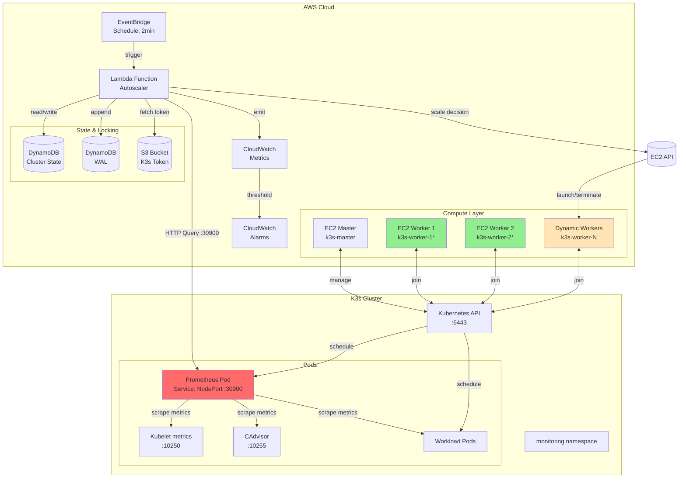
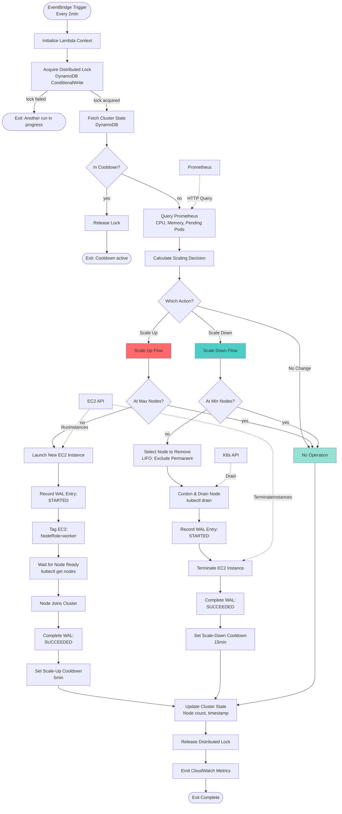
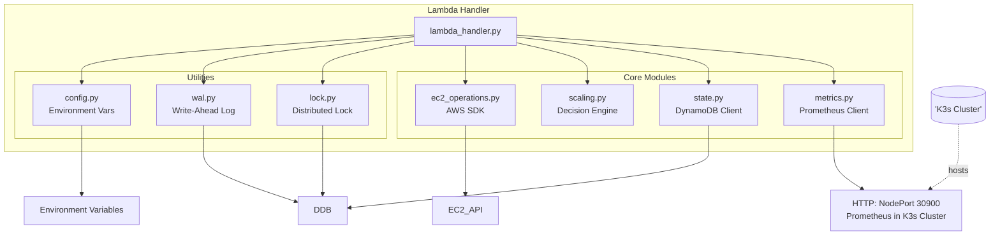
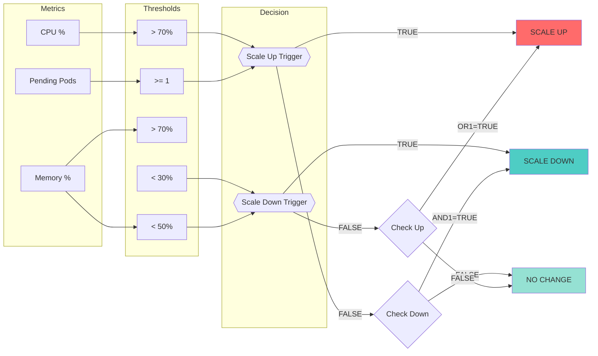
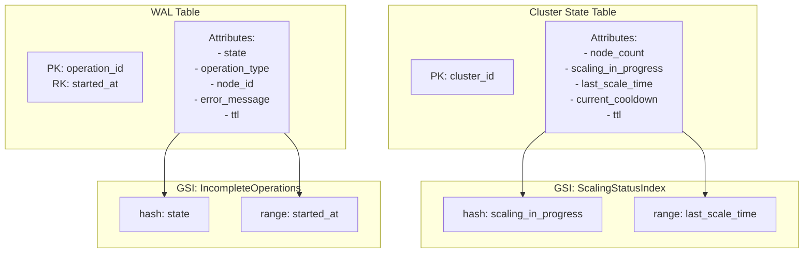
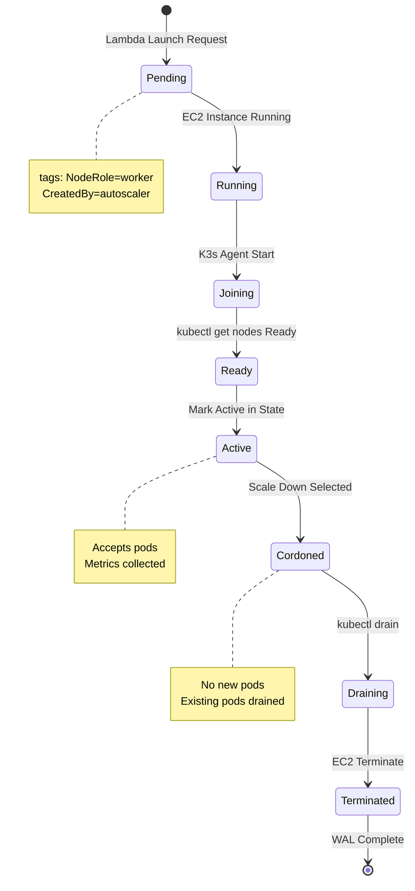
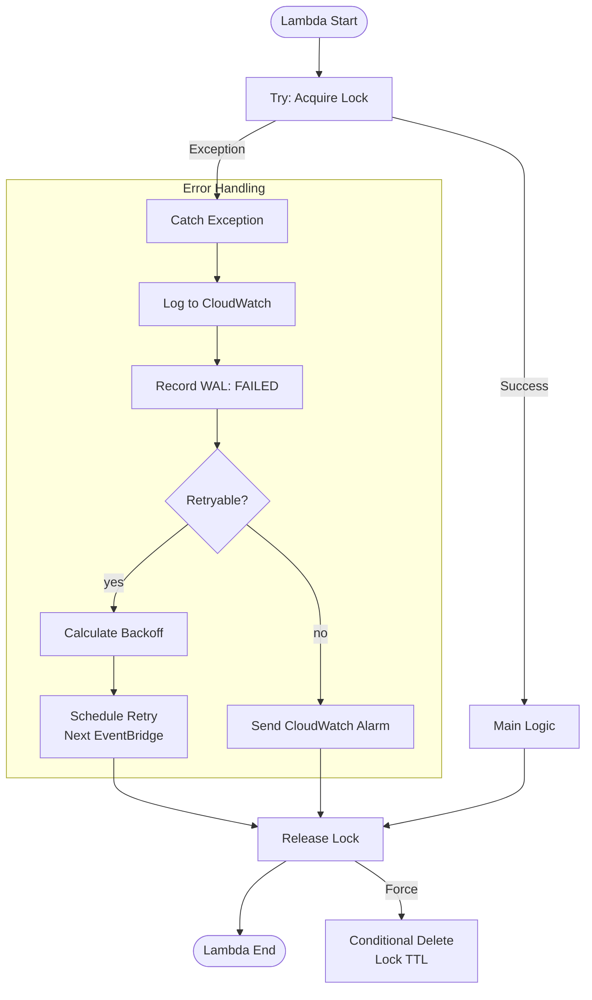

# K3s Autoscaler Architecture

## System Overview

## Autoscaler Decision Flow

## Lambda Internal Architecture

## Scaling Decision Logic

## State Management (DynamoDB)

## EC2 Instance Lifecycle

## Error Handling & Recovery

## Configuration

| Parameter | Default | Description |
|-----------|---------|-------------|
| `CHECK_INTERVAL` | 120s | EventBridge schedule |
| `SCALE_UP_THRESHOLD` | 70% | CPU threshold for scale-up |
| `SCALE_DOWN_THRESHOLD` | 30% | CPU threshold for scale-down |
| `SCALE_UP_COOLDOWN` | 300s | Wait after scale-up |
| `SCALE_DOWN_COOLDOWN` | 900s | Wait after scale-down |
| `MIN_NODES` | 2 | Minimum cluster size |
| `MAX_NODES` | 10 | Maximum cluster size |
| `NODE readiness_TIMEOUT` | 300s | Max wait for node ready |
| `PROMETHEUS_URL` | - | Prometheus NodePort: `http://<any-worker-ip>:30900` |
| `K3S_MASTER_URL` | - | Kubernetes API endpoint for drain operations |

**Note**: Prometheus runs as a pod in the K3s cluster. Lambda connects via NodePort service on port 30900 (accessible on any worker node IP).

## Data Flows

### Scale Up Flow
1. EventBridge triggers Lambda
2. Lambda acquires distributed lock (DynamoDB)
3. Query Prometheus: CPU > 70% OR pending_pods >= 1?
4. Check cooldown period expired
5. Check current nodes < MAX_NODES
6. **EC2.RunInstances()** with AMI, subnet, security group, IAM profile
7. Create WAL entry: state=STARTED
8. Wait for node: poll kubectl get nodes
9. Node Ready → Update WAL: state=SUCCEEDED
10. Update cluster state: node_count++, last_scale_time
11. Set scale-up cooldown (5 min)
12. Release lock

### Scale Down Flow
1. EventBridge triggers Lambda
2. Lambda acquires distributed lock
3. Query Prometheus: CPU < 30% AND Memory < 50%?
4. Check cooldown expired
5. Check current nodes > MIN_NODES
6. Select node: LIFO, exclude `Permanent=true`
7. **kubectl drain** node (evict pods)
8. Create WAL entry: state=STARTED
9. **EC2.TerminateInstances()**
10. Update WAL: state=SUCCEEDED
11. Update cluster state: node_count--, last_scale_time
12. Set scale-down cooldown (15 min)
13. Release lock